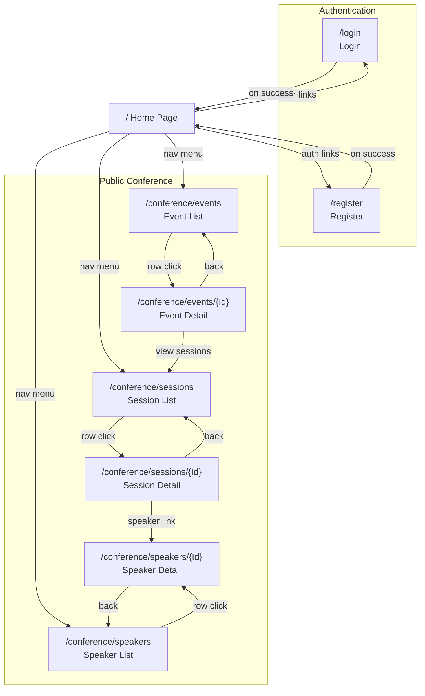
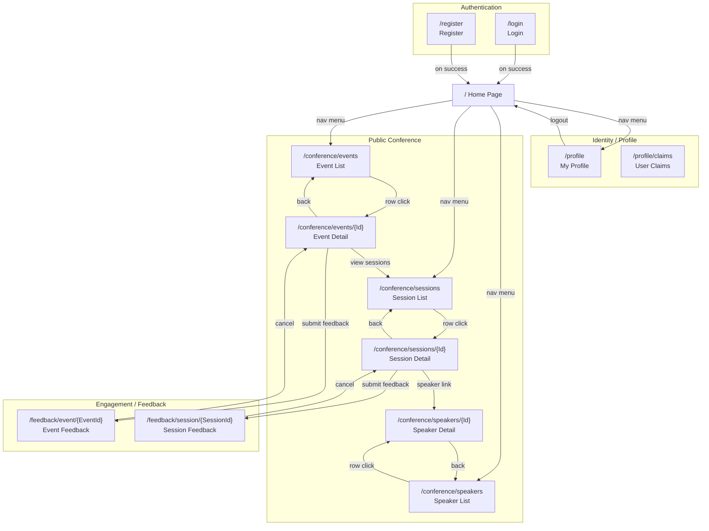
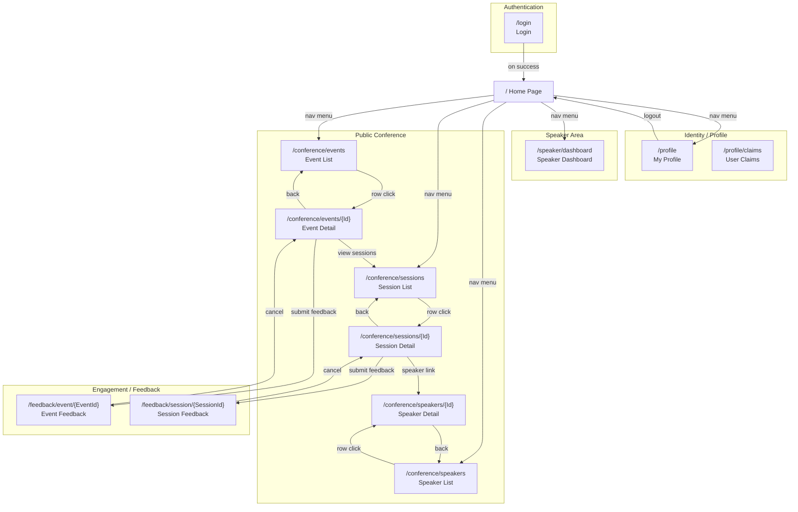
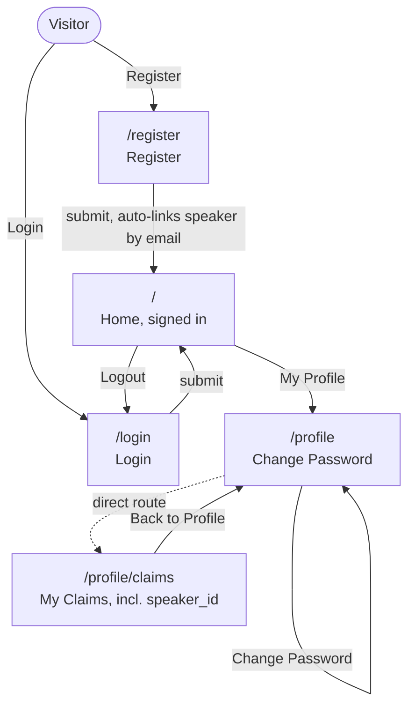
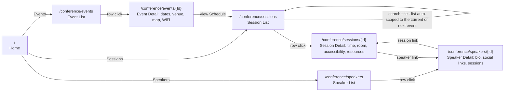
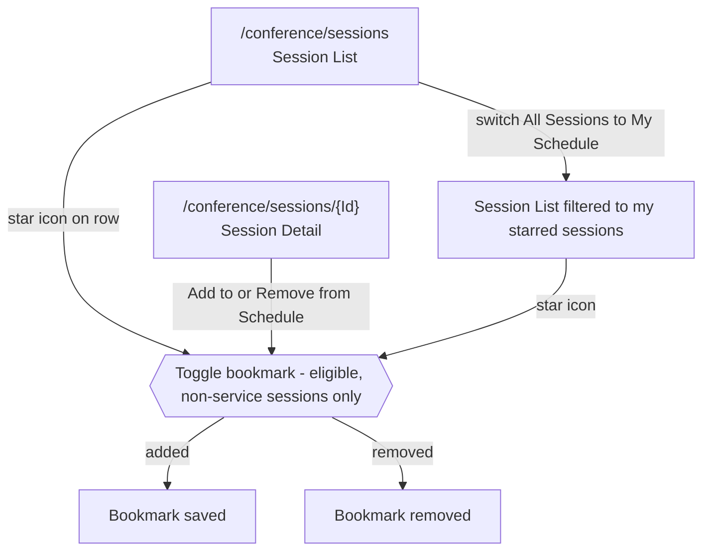
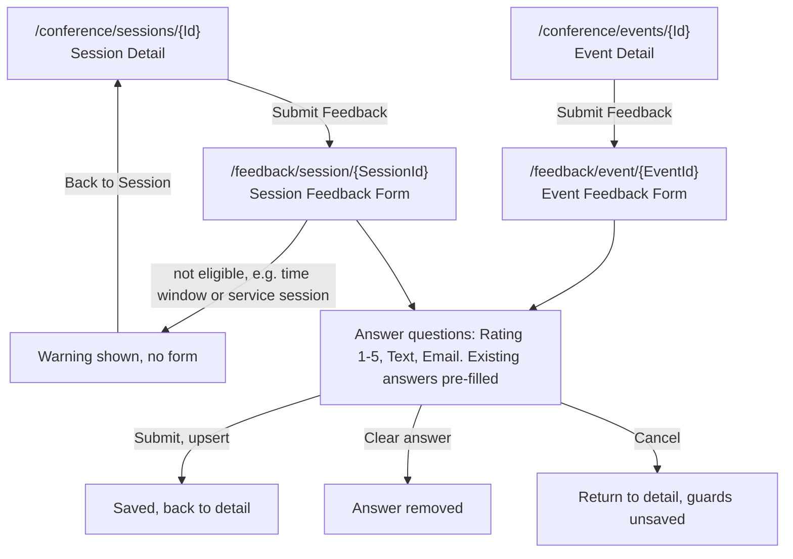
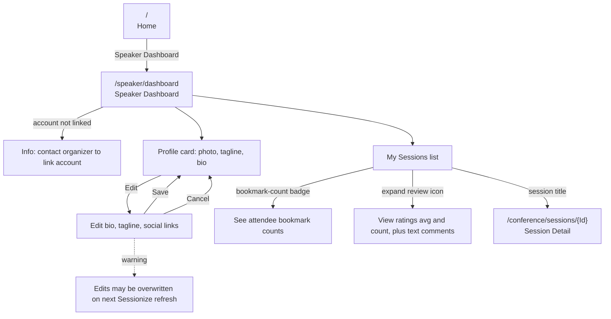

# Navigation Flow

This document maps the site navigation flow for each actor in the MMCA.ADC application. Each mermaid diagram shows the pages accessible to that actor and the directional navigation links between them.

## Actors

| Actor | Access Level | Identification |
|---|---|---|
| **Anonymous** | Public conference pages only | Not authenticated |
| **Attendee** | Public + profile + feedback + bookmarks | Authenticated, default `Attendee` role |
| **Speaker** | Attendee + speaker dashboard | Authenticated, account linked to a Speaker (`speaker_id` claim) |
| **Organizer** | Full access: conference CRUD, user management, feedback analytics, session selection | Authenticated, `Organizer` role |

> **Roles & menu:** `Organizer` is the only elevated role (default is `Attendee`). A *Speaker* is an attendee whose account is linked to a Speaker, surfaced via the `speaker_id` claim. The left nav is data-driven from each module's `IUIModule.NavItems` — items carry a required role (`Organizer`) or claim (`speaker_id`) and are hidden when the user lacks it. See **Authorization Model** at the end.

---

## 1. Anonymous User

Pages accessible without authentication: home, login, register, and all public conference pages.



---

## 2. Attendee (Authenticated User)

Inherits all anonymous pages. Gains access to profile, feedback submission, and session bookmarking. Unauthenticated visitors are redirected to login.



---

## 3. Speaker

Inherits all attendee pages. Gains access to the speaker dashboard for managing their own profile, viewing assigned sessions, and reviewing feedback ratings.



---

## 4. Organizer

Authenticated users with the `Organizer` role. Inherits all attendee and public pages. Adds CRUD management for every conference entity (events, sessions, speakers, categories, questions, rooms), user management, feedback analytics, and the AI-assisted **Session Selection Dashboard**. These items appear under the nav menu's *Admin* section (most grouped under "Conference").

```mermaid
flowchart TD
    subgraph Auth["Authentication"]
        Login["/login<br/>Login"]
    end

    subgraph Profile["Identity"]
        MyProfile["/profile<br/>My Profile"]
        Users["/users<br/>User Management"]
    end

    subgraph Public["Public Conference"]
        PubEvents["/conference/events<br/>Public Event List"]
        PubEventDetail["/conference/events/{Id}<br/>Public Event Detail"]
        PubSessions["/conference/sessions<br/>Public Session List"]
        PubSessionDetail["/conference/sessions/{Id}<br/>Public Session Detail"]
        PubSpeakers["/conference/speakers<br/>Public Speaker List"]
        PubSpeakerDetail["/conference/speakers/{Id}<br/>Public Speaker Detail"]
    end

    subgraph Engagement["Engagement / Feedback"]
        EventFeedback["/feedback/event/{EventId}<br/>Submit Event Feedback"]
        SessionFeedback["/feedback/session/{SessionId}<br/>Submit Session Feedback"]
    end

    subgraph EventMgmt["Organizer: Event Management"]
        EventList["/events<br/>Event List"]
        EventCreate["/events/create<br/>Create Event"]
        EventDetail["/events/{Id}<br/>Edit Event"]
        AdminEventFB["/events/{Id}/feedback<br/>Event Feedback Analytics"]
    end

    subgraph SessionMgmt["Organizer: Session Management"]
        SessionList["/sessions<br/>Session List"]
        SessionCreate["/sessions/create<br/>Create Session"]
        SessionDetail["/sessions/{Id}<br/>Edit Session"]
        AdminSessionFB["/sessions/{SessionId}/feedback<br/>Session Feedback Analytics"]
    end

    subgraph SpeakerMgmt["Organizer: Speaker Management"]
        SpeakerList["/speakers<br/>Speaker List"]
        SpeakerCreate["/speakers/create<br/>Create Speaker"]
        SpeakerDetail["/speakers/{Id}<br/>Edit Speaker"]
    end

    subgraph RefData["Organizer: Reference Data"]
        CatList["/conferencecategories<br/>Category List"]
        CatCreate["/conferencecategories/create<br/>Create Category"]
        CatDetail["/conferencecategories/{Id}<br/>Edit Category"]
        QuestionList["/questions<br/>Question List"]
        QuestionCreate["/questions/create<br/>Create Question"]
        QuestionDetail["/questions/{Id}<br/>Edit Question"]
        RoomList["/rooms<br/>Room List"]
        RoomCreate["/rooms/create<br/>Create Room"]
        RoomDetail["/rooms/{Id}<br/>Edit Room"]
    end

    subgraph Decision["Organizer: Session Selection"]
        SessionSelection["/sessions/selection-dashboard<br/>Session Selection Dashboard<br/>status mix, AI scoring"]
    end

    Home["/  Home Page"]

    %% Top-level navigation
    Home -->|nav menu| PubEvents
    Home -->|nav menu| PubSessions
    Home -->|nav menu| PubSpeakers
    Home -->|nav menu| MyProfile
    Home -->|nav menu| Users
    Home -->|nav menu| EventList
    Home -->|nav menu| SessionList
    Home -->|nav menu| SpeakerList
    Home -->|nav menu| CatList
    Home -->|nav menu| QuestionList
    Home -->|nav menu| RoomList
    Home -->|nav menu| SessionSelection

    Login -->|on success| Home
    MyProfile -->|logout| Home

    %% Public flows
    PubEvents -->|row click| PubEventDetail
    PubEventDetail -->|back| PubEvents
    PubEventDetail -->|view sessions| PubSessions
    PubEventDetail -->|submit feedback| EventFeedback
    PubSessions -->|row click| PubSessionDetail
    PubSessionDetail -->|back| PubSessions
    PubSessionDetail -->|speaker link| PubSpeakerDetail
    PubSessionDetail -->|submit feedback| SessionFeedback
    PubSpeakers -->|row click| PubSpeakerDetail
    PubSpeakerDetail -->|back| PubSpeakers
    EventFeedback -->|cancel| PubEventDetail
    SessionFeedback -->|cancel| PubSessionDetail

    %% Event CRUD
    EventList -->|create| EventCreate
    EventList -->|row click| EventDetail
    EventCreate -->|on success| EventDetail
    EventCreate -->|back| EventList
    EventDetail -->|back| EventList
    EventDetail -->|view feedback| AdminEventFB

    %% Session CRUD
    SessionList -->|create| SessionCreate
    SessionList -->|row click| SessionDetail
    SessionCreate -->|on success| SessionDetail
    SessionCreate -->|back| SessionList
    SessionDetail -->|back| SessionList
    SessionDetail -->|view feedback| AdminSessionFB

    %% Speaker CRUD
    SpeakerList -->|create| SpeakerCreate
    SpeakerList -->|row click| SpeakerDetail
    SpeakerCreate -->|on success| SpeakerDetail
    SpeakerCreate -->|back| SpeakerList
    SpeakerDetail -->|back| SpeakerList

    %% Cross-entity navigation
    EventDetail -->|click speaker| SpeakerDetail
    EventDetail -->|click room| RoomDetail
    SpeakerDetail -->|click session| SessionDetail
    SessionSelection -->|click speaker| SpeakerDetail
    SessionSelection -->|click session| SessionDetail

    %% Category CRUD
    CatList -->|create| CatCreate
    CatList -->|row click| CatDetail
    CatCreate -->|on success| CatDetail
    CatCreate -->|back| CatList
    CatDetail -->|back| CatList

    %% Question CRUD
    QuestionList -->|create| QuestionCreate
    QuestionList -->|row click| QuestionDetail
    QuestionCreate -->|on success| QuestionDetail
    QuestionCreate -->|back| QuestionList
    QuestionDetail -->|back| QuestionList

    %% Room CRUD
    RoomList -->|create| RoomCreate
    RoomList -->|row click| RoomDetail
    RoomCreate -->|on success| RoomDetail
    RoomCreate -->|back| RoomList
    RoomDetail -->|back| RoomList
```



---

## 5. Functionality Flows (Attendee & Speaker)

The diagrams in sections 1–4 map *which pages* each actor can reach. The diagrams below map *how attendees and speakers accomplish each functionality*, including inline actions — bookmarking, schedule filtering, dashboard editing — that are not separate pages. Pages appear as `route` nodes; edge labels are user actions. Flows in 5.3–5.5 require authentication.

### 5.1 Account & Identity



### 5.2 Discover the Schedule (also available anonymously)



### 5.3 Personal Schedule / Bookmarking



### 5.4 Submit & Manage Feedback



### 5.5 Speaker Dashboard (requires `speaker_id` claim)



---

## Navigation Patterns

### Authentication Redirects
- Unauthenticated users accessing protected pages are redirected to `/login` via the `RedirectToLogin` component.
- Successful login/register redirects to Home (`/`) with a full page reload.
- Logout (from NavMenu, MainLayout, or Profile) redirects to `/login` with a full page reload.

### Authorization Model
- **Roles:** `Organizer` is the only elevated role; every other authenticated user is an `Attendee` (the default). There is no separate "Admin" role.
- **Speaker:** not a role — an attendee whose account is linked to a Speaker, surfaced as the `speaker_id` JWT claim (auto-linked by email match at registration, or linked manually by an organizer).
- **Menu-driven visibility:** the left nav is built from each module's `IUIModule.NavItems`. Items declare a required role (`Organizer`) or claim (`speaker_id`); the menu hides what the current user can't use. Organizer items sit in the *Admin* nav section (most grouped under "Conference"); "My Profile" and the Speaker "Dashboard" sit in the *User* section.
- **Page guards (`@attribute [Authorize…]`):**
  - *Organizer role required:* `/sessions/selection-dashboard`, `/events/{Id}/feedback`, `/sessions/{SessionId}/feedback`, and every conference/user management page (`/events`, `/sessions`, `/speakers`, `/conferencecategories`, `/questions`, `/rooms`, `/users`), each carrying a page-level `[Authorize(Roles = "Organizer")]` (e.g. `EventList.razor`, `UserList.razor`). The shared `Routes.razor` renders the Forbidden page for an authenticated non-Organizer; the inherited `RegisteredUser_AdminPages_ShouldBeForbidden` E2E fact pins this for all seven routes. API-side role enforcement applies as well (defense in depth).
  - *Authentication only:* `/profile`, `/profile/claims`, `/speaker/dashboard`, both attendee feedback forms, and `/speakers/{Id}` (SpeakerDetail is the one management page still gated by plain `[Authorize]` because linked speakers edit their own bio there; organizer-only actions on it are enforced API-side).
  - *Public (no attribute):* all `/conference/*` read pages.

### CRUD Pattern (Organizer)
All admin entity management follows the same navigation pattern:
```
List ──row click──► Detail ──back──► List
 │                    ▲
 └──create──► Create ─┘ (on success)
              │
              └──back──► List
```

### Cross-Entity Links (Organizer)
- **Event Detail** links to Speaker Detail and Room Detail for associated entities.
- **Speaker Detail** links to Session Detail for assigned sessions.
- **Session Selection Dashboard** links to Speaker Detail and Session Detail for each analyzed speaker/session.

### Public → Engagement Flow
- **Public Event Detail** and **Public Session Detail** show a "Submit Feedback" button (visible to authenticated users only) that navigates to the corresponding feedback form.
- Feedback forms navigate back to the originating public detail page on cancel.

