# Navigation Flow

This document maps the site navigation flow for each actor in the MMCA.ADC application. Each mermaid diagram shows the pages accessible to that actor and the directional navigation links between them.

## Actors

| Actor | Access Level | Identification |
|---|---|---|
| **Anonymous** | Public conference pages only | Not authenticated |
| **Attendee** | Public + profile + feedback + bookmarks | Authenticated, default `Attendee` role |
| **Speaker** | Attendee + speaker dashboard | Authenticated, account linked to a Speaker (`speaker_id` claim) |
| **Organizer** | Full access: conference CRUD, user management, feedback analytics, session selection | Authenticated, `Organizer` role |

> **Roles & menu:** `Organizer` is the only elevated role (default is `Attendee`). A *Speaker* is an attendee whose account is linked to a Speaker, surfaced via the `speaker_id` claim. The left nav is data-driven from each module's `IUIModule.NavItems`: items carry a required role (`Organizer`) or claim (`speaker_id`) and are hidden when the user lacks it. See **Authorization Model** at the end.

---

## 1. Anonymous User

Pages accessible without authentication: home, login, register, the two password-reset pages, and all public conference pages.

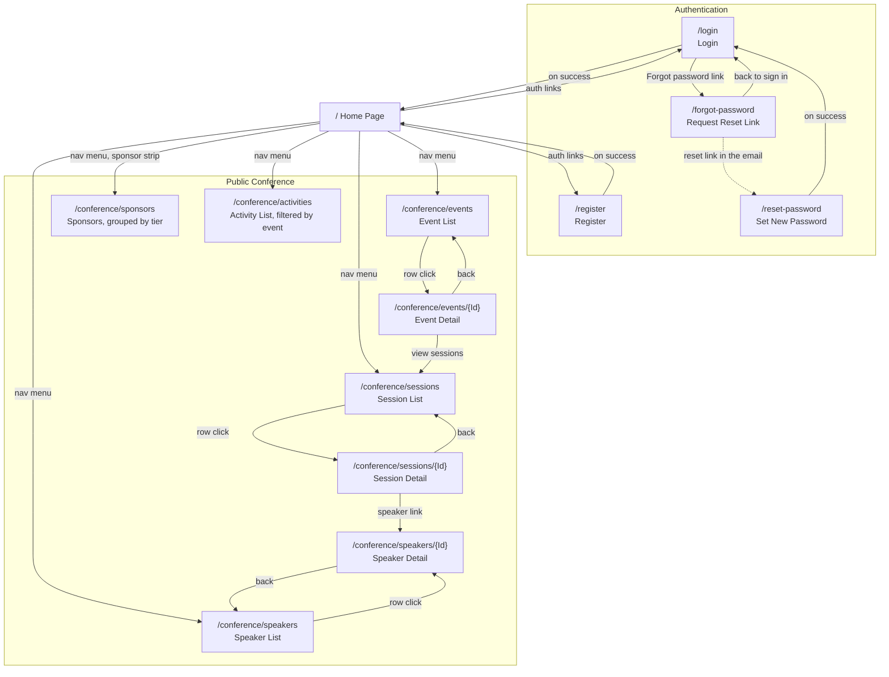
```mermaid
flowchart TD
    subgraph Auth["Authentication"]
        Login["/login<br/>Login"]
        Register["/register<br/>Register"]
        ForgotPassword["/forgot-password<br/>Request Reset Link"]
        ResetPassword["/reset-password<br/>Set New Password"]
    end

    subgraph Public["Public Conference"]
        PubEvents["/conference/events<br/>Event List"]
        PubEventDetail["/conference/events/{Id}<br/>Event Detail"]
        PubSessions["/conference/sessions<br/>Session List"]
        PubSessionDetail["/conference/sessions/{Id}<br/>Session Detail"]
        PubSpeakers["/conference/speakers<br/>Speaker List"]
        PubSpeakerDetail["/conference/speakers/{Id}<br/>Speaker Detail"]
        PubSponsors["/conference/sponsors<br/>Sponsors, grouped by tier"]
        PubActivities["/conference/activities<br/>Activity List, filtered by event"]
    end

    Home["/  Home Page"]

    Home -->|nav menu| PubEvents
    Home -->|nav menu| PubSessions
    Home -->|nav menu| PubSpeakers
    Home -->|nav menu, sponsor strip| PubSponsors
    Home -->|nav menu| PubActivities
    Home -->|auth links| Login
    Home -->|auth links| Register

    Login -->|on success| Home
    Register -->|on success| Home

    Login -->|Forgot password link| ForgotPassword
    ForgotPassword -->|back to sign in| Login
    ForgotPassword -.->|reset link in the email| ResetPassword
    ResetPassword -->|on success| Login

    PubEvents -->|row click| PubEventDetail
    PubEventDetail -->|back| PubEvents
    PubEventDetail -->|view sessions| PubSessions

    PubSessions -->|row click| PubSessionDetail
    PubSessionDetail -->|back| PubSessions
    PubSessionDetail -->|speaker link| PubSpeakerDetail

    PubSpeakers -->|row click| PubSpeakerDetail
    PubSpeakerDetail -->|back| PubSpeakers
```

---

## 2. Attendee (Authenticated User)

Inherits all anonymous pages. Gains access to profile, feedback submission, and session bookmarking. Unauthenticated visitors are redirected to login.

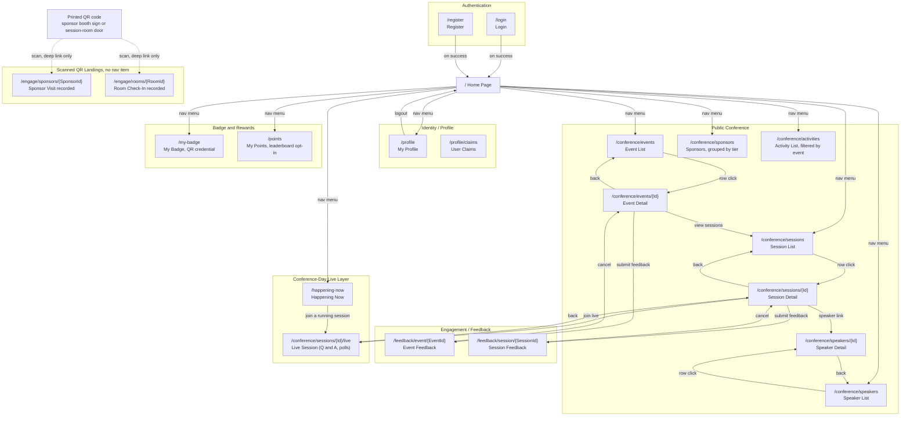
```mermaid
flowchart TD
    subgraph Auth["Authentication"]
        Login["/login<br/>Login"]
        Register["/register<br/>Register"]
    end

    subgraph Profile["Identity / Profile"]
        MyProfile["/profile<br/>My Profile"]
        Claims["/profile/claims<br/>User Claims"]
    end

    subgraph Public["Public Conference"]
        PubEvents["/conference/events<br/>Event List"]
        PubEventDetail["/conference/events/{Id}<br/>Event Detail"]
        PubSessions["/conference/sessions<br/>Session List"]
        PubSessionDetail["/conference/sessions/{Id}<br/>Session Detail"]
        PubSpeakers["/conference/speakers<br/>Speaker List"]
        PubSpeakerDetail["/conference/speakers/{Id}<br/>Speaker Detail"]
        PubSponsors["/conference/sponsors<br/>Sponsors, grouped by tier"]
        PubActivities["/conference/activities<br/>Activity List, filtered by event"]
    end

    subgraph Engagement["Engagement / Feedback"]
        EventFeedback["/feedback/event/{EventId}<br/>Event Feedback"]
        SessionFeedback["/feedback/session/{SessionId}<br/>Session Feedback"]
    end

    subgraph Live["Conference-Day Live Layer"]
        HappeningNow["/happening-now<br/>Happening Now"]
        SessionLive["/conference/sessions/{Id}/live<br/>Live Session (Q and A, polls)"]
    end

    subgraph Badge["Badge and Rewards"]
        MyBadge["/my-badge<br/>My Badge, QR credential"]
        MyPoints["/points<br/>My Points, leaderboard opt-in"]
    end

    subgraph QrLanding["Scanned QR Landings, no nav item"]
        SponsorVisit["/engage/sponsors/{SponsorId}<br/>Sponsor Visit recorded"]
        RoomCheckIn["/engage/rooms/{RoomId}<br/>Room Check-In recorded"]
    end

    Home["/  Home Page"]

    Home -->|nav menu| PubEvents
    Home -->|nav menu| PubSessions
    Home -->|nav menu| PubSpeakers
    Home -->|nav menu| PubSponsors
    Home -->|nav menu| PubActivities
    Home -->|nav menu| MyProfile
    Home -->|nav menu| HappeningNow
    Home -->|nav menu| MyBadge
    Home -->|nav menu| MyPoints

    HappeningNow -->|join a running session| SessionLive
    PubSessionDetail -->|join live| SessionLive
    SessionLive -->|back| PubSessionDetail

    PrintedQr["Printed QR code<br/>sponsor booth sign or session-room door"]
    PrintedQr -.->|scan, deep link only| SponsorVisit
    PrintedQr -.->|scan, deep link only| RoomCheckIn

    Login -->|on success| Home
    Register -->|on success| Home
    MyProfile -->|logout| Home

    PubEvents -->|row click| PubEventDetail
    PubEventDetail -->|back| PubEvents
    PubEventDetail -->|view sessions| PubSessions
    PubEventDetail -->|submit feedback| EventFeedback

    PubSessions -->|row click| PubSessionDetail
    PubSessionDetail -->|back| PubSessions
    PubSessionDetail -->|speaker link| PubSpeakerDetail
    PubSessionDetail -->|submit feedback| SessionFeedback

    PubSpeakers -->|row click| PubSpeakerDetail
    PubSpeakerDetail -->|back| PubSpeakers

    EventFeedback -->|cancel| PubEventDetail
    SessionFeedback -->|cancel| PubSessionDetail
```

---

## 3. Speaker

Inherits all attendee pages. Gains access to the speaker dashboard for managing their own profile, viewing assigned sessions, and reviewing feedback ratings.

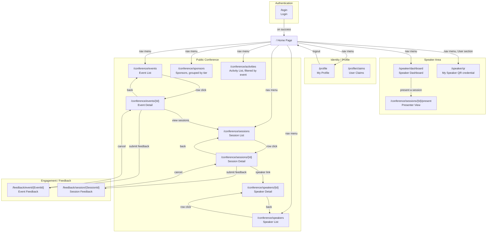
```mermaid
flowchart TD
    subgraph Auth["Authentication"]
        Login["/login<br/>Login"]
    end

    subgraph Profile["Identity / Profile"]
        MyProfile["/profile<br/>My Profile"]
        Claims["/profile/claims<br/>User Claims"]
    end

    subgraph Speaker["Speaker Area"]
        Dashboard["/speaker/dashboard<br/>Speaker Dashboard"]
        SpeakerQr["/speaker/qr<br/>My Speaker QR credential"]
        Presenter["/conference/sessions/{Id}/present<br/>Presenter View"]
    end

    subgraph Public["Public Conference"]
        PubEvents["/conference/events<br/>Event List"]
        PubEventDetail["/conference/events/{Id}<br/>Event Detail"]
        PubSessions["/conference/sessions<br/>Session List"]
        PubSessionDetail["/conference/sessions/{Id}<br/>Session Detail"]
        PubSpeakers["/conference/speakers<br/>Speaker List"]
        PubSpeakerDetail["/conference/speakers/{Id}<br/>Speaker Detail"]
        PubSponsors["/conference/sponsors<br/>Sponsors, grouped by tier"]
        PubActivities["/conference/activities<br/>Activity List, filtered by event"]
    end

    subgraph Engagement["Engagement / Feedback"]
        EventFeedback["/feedback/event/{EventId}<br/>Event Feedback"]
        SessionFeedback["/feedback/session/{SessionId}<br/>Session Feedback"]
    end

    Home["/  Home Page"]

    Home -->|nav menu| PubEvents
    Home -->|nav menu| PubSessions
    Home -->|nav menu| PubSpeakers
    Home -->|nav menu| PubSponsors
    Home -->|nav menu| PubActivities
    Home -->|nav menu| MyProfile
    Home -->|nav menu| Dashboard
    Home -->|nav menu, User section| SpeakerQr

    Dashboard -->|present a session| Presenter

    Login -->|on success| Home
    MyProfile -->|logout| Home

    PubEvents -->|row click| PubEventDetail
    PubEventDetail -->|back| PubEvents
    PubEventDetail -->|view sessions| PubSessions
    PubEventDetail -->|submit feedback| EventFeedback

    PubSessions -->|row click| PubSessionDetail
    PubSessionDetail -->|back| PubSessions
    PubSessionDetail -->|speaker link| PubSpeakerDetail
    PubSessionDetail -->|submit feedback| SessionFeedback

    PubSpeakers -->|row click| PubSpeakerDetail
    PubSpeakerDetail -->|back| PubSpeakers

    EventFeedback -->|cancel| PubEventDetail
    SessionFeedback -->|cancel| PubSessionDetail
```

---

## 4. Organizer

Authenticated users with the `Organizer` role. Inherits all attendee and public pages. Adds CRUD management for every conference entity (events, sessions, speakers, categories, questions, rooms, sponsors, activities), user management, feedback analytics, the badge **check-in** and attendance pages, the points overview, and the AI-assisted **Session Selection Dashboard**. These items appear under the nav menu's *Admin* section (most grouped under "Conference").


```mermaid
flowchart TD
    subgraph Auth["Authentication"]
        Login["/login<br/>Login"]
    end

    subgraph Profile["Identity"]
        MyProfile["/profile<br/>My Profile"]
        Users["/users<br/>User Management"]
    end

    subgraph Public["Public Conference"]
        PubEvents["/conference/events<br/>Public Event List"]
        PubEventDetail["/conference/events/{Id}<br/>Public Event Detail"]
        PubSessions["/conference/sessions<br/>Public Session List"]
        PubSessionDetail["/conference/sessions/{Id}<br/>Public Session Detail"]
        PubSpeakers["/conference/speakers<br/>Public Speaker List"]
        PubSpeakerDetail["/conference/speakers/{Id}<br/>Public Speaker Detail"]
        PubSponsors["/conference/sponsors<br/>Public Sponsors, grouped by tier"]
        PubActivities["/conference/activities<br/>Public Activity List"]
    end

    subgraph Engagement["Engagement / Feedback"]
        EventFeedback["/feedback/event/{EventId}<br/>Submit Event Feedback"]
        SessionFeedback["/feedback/session/{SessionId}<br/>Submit Session Feedback"]
    end

    subgraph EventMgmt["Organizer: Event Management"]
        EventList["/events<br/>Event List"]
        EventCreate["/events/create<br/>Create Event"]
        EventDetail["/events/{Id}<br/>Edit Event"]
        AdminEventFB["/events/{EventId}/feedback<br/>Event Feedback Analytics"]
    end

    subgraph SessionMgmt["Organizer: Session Management"]
        SessionList["/sessions<br/>Session List"]
        SessionCreate["/sessions/create<br/>Create Session"]
        SessionDetail["/sessions/{Id}<br/>Edit Session"]
        AdminSessionFB["/sessions/{SessionId}/feedback<br/>Session Feedback Analytics"]
    end

    subgraph SpeakerMgmt["Organizer: Speaker Management"]
        SpeakerList["/speakers<br/>Speaker List"]
        SpeakerCreate["/speakers/create<br/>Create Speaker"]
        SpeakerDetail["/speakers/{Id}<br/>Edit Speaker"]
    end

    subgraph RefData["Organizer: Reference Data"]
        CatList["/conferencecategories<br/>Category List"]
        CatCreate["/conferencecategories/create<br/>Create Category"]
        CatDetail["/conferencecategories/{Id}<br/>Edit Category"]
        QuestionList["/questions<br/>Question List"]
        QuestionCreate["/questions/create<br/>Create Question"]
        QuestionDetail["/questions/{Id}<br/>Edit Question"]
        RoomList["/rooms<br/>Room List"]
        RoomCreate["/rooms/create<br/>Create Room"]
        RoomDetail["/rooms/{Id}<br/>Edit Room"]
    end

    subgraph SponsorMgmt["Organizer: Sponsor Management"]
        SponsorList["/sponsors<br/>Sponsor List"]
        SponsorCreate["/sponsors/create<br/>Create Sponsor"]
        SponsorDetail["/sponsors/{Id}<br/>Edit Sponsor"]
    end

    subgraph ActivityMgmt["Organizer: Activity Management"]
        ActivityList["/activities<br/>Activity List"]
        ActivityCreate["/activities/create<br/>Create Activity"]
        ActivityDetail["/activities/{Id}<br/>Edit Activity"]
    end

    subgraph CheckIn["Organizer: Check-In and Rewards"]
        Scan["/check-in<br/>Scan Badges<br/>camera on MAUI, search on web"]
        Attendance["/organizer/attendance<br/>Attendance Overview"]
        PointsOverview["/organizer/points<br/>Points Overview"]
    end

    subgraph Decision["Organizer: Session Selection"]
        SessionSelection["/sessions/selection-dashboard<br/>Session Selection Dashboard<br/>status mix, AI scoring"]
    end

    Home["/  Home Page"]

    %% Top-level navigation
    Home -->|nav menu| PubEvents
    Home -->|nav menu| PubSessions
    Home -->|nav menu| PubSpeakers
    Home -->|nav menu| MyProfile
    Home -->|nav menu| Users
    Home -->|nav menu| EventList
    Home -->|nav menu| SessionList
    Home -->|nav menu| SpeakerList
    Home -->|nav menu| CatList
    Home -->|nav menu| QuestionList
    Home -->|nav menu| RoomList
    Home -->|nav menu| SponsorList
    Home -->|nav menu| ActivityList
    Home -->|nav menu| Scan
    Home -->|nav menu| Attendance
    Home -->|nav menu| PointsOverview
    Home -->|nav menu| SessionSelection

    Login -->|on success| Home
    MyProfile -->|logout| Home

    %% Public flows
    PubEvents -->|row click| PubEventDetail
    PubEventDetail -->|back| PubEvents
    PubEventDetail -->|view sessions| PubSessions
    PubEventDetail -->|submit feedback| EventFeedback
    PubSessions -->|row click| PubSessionDetail
    PubSessionDetail -->|back| PubSessions
    PubSessionDetail -->|speaker link| PubSpeakerDetail
    PubSessionDetail -->|submit feedback| SessionFeedback
    PubSpeakers -->|row click| PubSpeakerDetail
    PubSpeakerDetail -->|back| PubSpeakers
    EventFeedback -->|cancel| PubEventDetail
    SessionFeedback -->|cancel| PubSessionDetail

    %% Event CRUD
    EventList -->|create| EventCreate
    EventList -->|row click| EventDetail
    EventCreate -->|on success| EventDetail
    EventCreate -->|back| EventList
    EventDetail -->|back| EventList
    EventDetail -->|view feedback| AdminEventFB

    %% Session CRUD
    SessionList -->|create| SessionCreate
    SessionList -->|row click| SessionDetail
    SessionCreate -->|on success| SessionDetail
    SessionCreate -->|back| SessionList
    SessionDetail -->|back| SessionList
    SessionDetail -->|view feedback| AdminSessionFB

    %% Speaker CRUD
    SpeakerList -->|create| SpeakerCreate
    SpeakerList -->|row click| SpeakerDetail
    SpeakerCreate -->|on success| SpeakerDetail
    SpeakerCreate -->|back| SpeakerList
    SpeakerDetail -->|back| SpeakerList

    %% Cross-entity navigation
    EventDetail -->|click speaker| SpeakerDetail
    EventDetail -->|click room| RoomDetail
    SpeakerDetail -->|click session| SessionDetail
    SessionSelection -->|click speaker| SpeakerDetail
    SessionSelection -->|click session| SessionDetail

    %% Category CRUD
    CatList -->|create| CatCreate
    CatList -->|row click| CatDetail
    CatCreate -->|on success| CatDetail
    CatCreate -->|back| CatList
    CatDetail -->|back| CatList

    %% Question CRUD
    QuestionList -->|create| QuestionCreate
    QuestionList -->|row click| QuestionDetail
    QuestionCreate -->|on success| QuestionDetail
    QuestionCreate -->|back| QuestionList
    QuestionDetail -->|back| QuestionList

    %% Room CRUD
    RoomList -->|create| RoomCreate
    RoomList -->|row click| RoomDetail
    RoomCreate -->|on success| RoomDetail
    RoomCreate -->|back| RoomList
    RoomDetail -->|back| RoomList

    %% Sponsor CRUD
    SponsorList -->|create| SponsorCreate
    SponsorList -->|row click| SponsorDetail
    SponsorCreate -->|on success| SponsorDetail
    SponsorCreate -->|back| SponsorList
    SponsorDetail -->|back| SponsorList

    %% Activity CRUD
    ActivityList -->|create| ActivityCreate
    ActivityList -->|row click| ActivityDetail
    ActivityCreate -->|on success| ActivityDetail
    ActivityCreate -->|back| ActivityList
    ActivityDetail -->|back| ActivityList
```

---

## 5. Functionality Flows (Attendee & Speaker)

The diagrams in sections 1-4 map *which pages* each actor can reach. The diagrams below map *how attendees and speakers accomplish each functionality*, including inline actions (bookmarking, schedule filtering, dashboard editing) that are not separate pages. Pages appear as `route` nodes; edge labels are user actions. Flows in 5.3-5.5 and 5.8 require authentication; 5.9 covers one public route and three Organizer-only ones.

### 5.1 Account & Identity

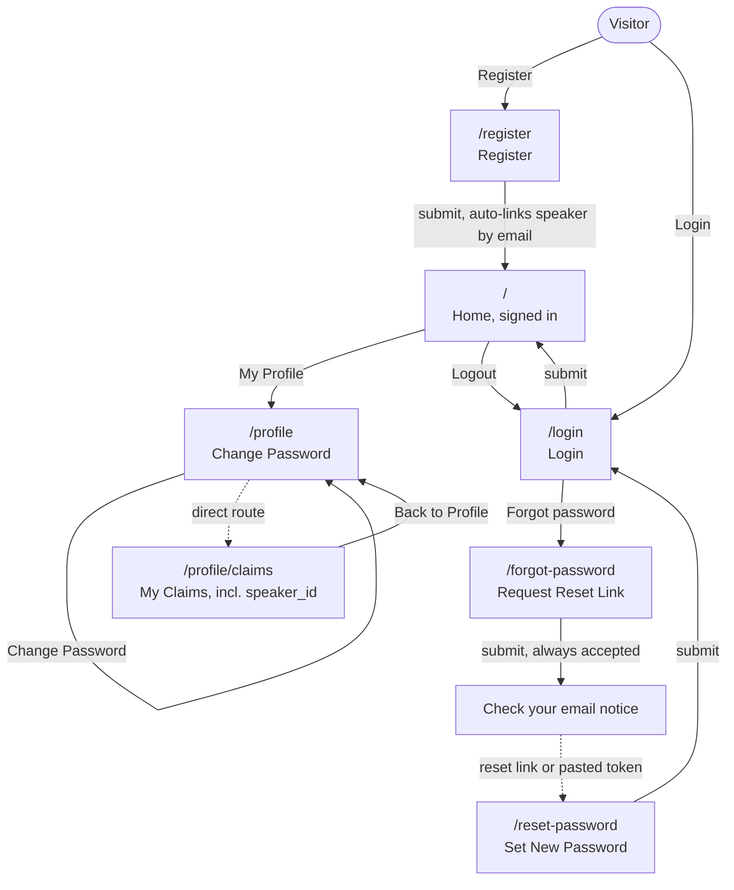
```mermaid
flowchart TD
    Visitor(["Visitor"]) -->|Register| Register["/register<br/>Register"]
    Visitor -->|Login| Login["/login<br/>Login"]
    Register -->|submit, auto-links speaker by email| Home["/<br/>Home, signed in"]
    Login -->|submit| Home
    Login -->|Forgot password| ForgotPassword["/forgot-password<br/>Request Reset Link"]
    ForgotPassword -->|submit, always accepted| Sent["Check your email notice"]
    Sent -.->|reset link or pasted token| ResetPassword["/reset-password<br/>Set New Password"]
    ResetPassword -->|submit| Login
    Home -->|My Profile| Profile["/profile<br/>Change Password"]
    Profile -->|Change Password| Profile
    Profile -.->|direct route| Claims["/profile/claims<br/>My Claims, incl. speaker_id"]
    Claims -->|Back to Profile| Profile
    Home -->|Logout| Login
```

### 5.2 Discover the Schedule (also available anonymously)

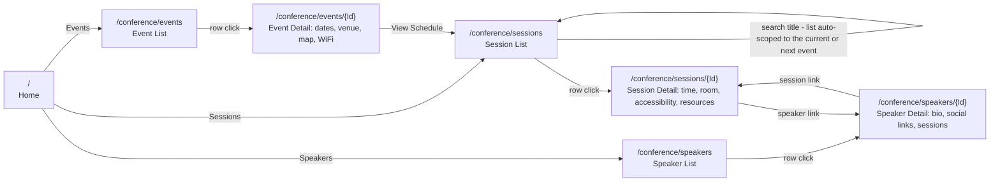
```mermaid
flowchart LR
    Home["/<br/>Home"] -->|Events| Events["/conference/events<br/>Event List"]
    Home -->|Sessions| Sessions["/conference/sessions<br/>Session List"]
    Home -->|Speakers| Speakers["/conference/speakers<br/>Speaker List"]
    Events -->|row click| EventDetail["/conference/events/{Id}<br/>Event Detail: dates, venue, map, WiFi"]
    EventDetail -->|View Schedule| Sessions
    Sessions -->|search title - list auto-scoped to the current or next event| Sessions
    Sessions -->|row click| SessionDetail["/conference/sessions/{Id}<br/>Session Detail: time, room, accessibility, resources"]
    Speakers -->|row click| SpeakerDetail["/conference/speakers/{Id}<br/>Speaker Detail: bio, social links, sessions"]
    SessionDetail -->|speaker link| SpeakerDetail
    SpeakerDetail -->|session link| SessionDetail
```

### 5.3 Personal Schedule / Bookmarking

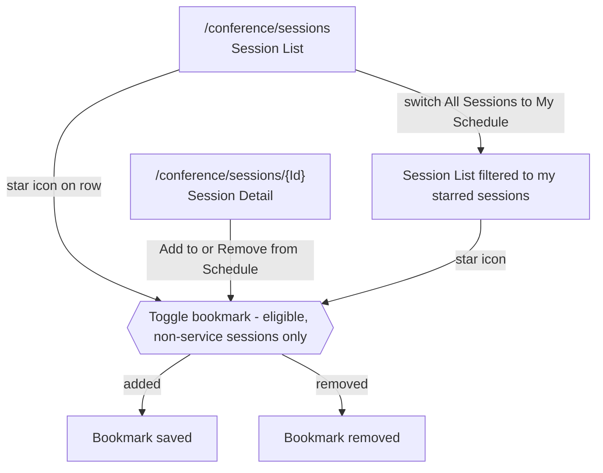
```mermaid
flowchart TD
    Sessions["/conference/sessions<br/>Session List"] -->|star icon on row| Toggle{{"Toggle bookmark - eligible, non-service sessions only"}}
    SessionDetail["/conference/sessions/{Id}<br/>Session Detail"] -->|Add to or Remove from Schedule| Toggle
    Toggle -->|added| Saved["Bookmark saved"]
    Toggle -->|removed| Removed["Bookmark removed"]
    Sessions -->|switch All Sessions to My Schedule| MySchedule["Session List filtered to my starred sessions"]
    MySchedule -->|star icon| Toggle
```

### 5.4 Submit & Manage Feedback

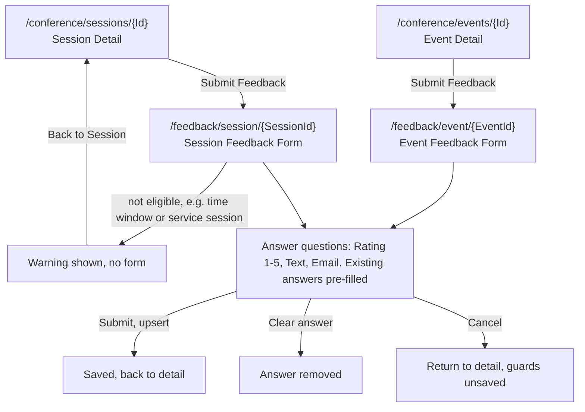
```mermaid
flowchart TD
    EventDetail["/conference/events/{Id}<br/>Event Detail"] -->|Submit Feedback| EventFB["/feedback/event/{EventId}<br/>Event Feedback Form"]
    SessionDetail["/conference/sessions/{Id}<br/>Session Detail"] -->|Submit Feedback| SessionFB["/feedback/session/{SessionId}<br/>Session Feedback Form"]
    SessionFB -->|not eligible, e.g. time window or service session| Blocked["Warning shown, no form"]
    Blocked -->|Back to Session| SessionDetail
    EventFB --> Answer["Answer questions: Rating 1-5, Text, Email. Existing answers pre-filled"]
    SessionFB --> Answer
    Answer -->|Submit, upsert| Done["Saved, back to detail"]
    Answer -->|Clear answer| Deleted["Answer removed"]
    Answer -->|Cancel| Back["Return to detail, guards unsaved"]
```

### 5.5 Speaker Dashboard (requires `speaker_id` claim)

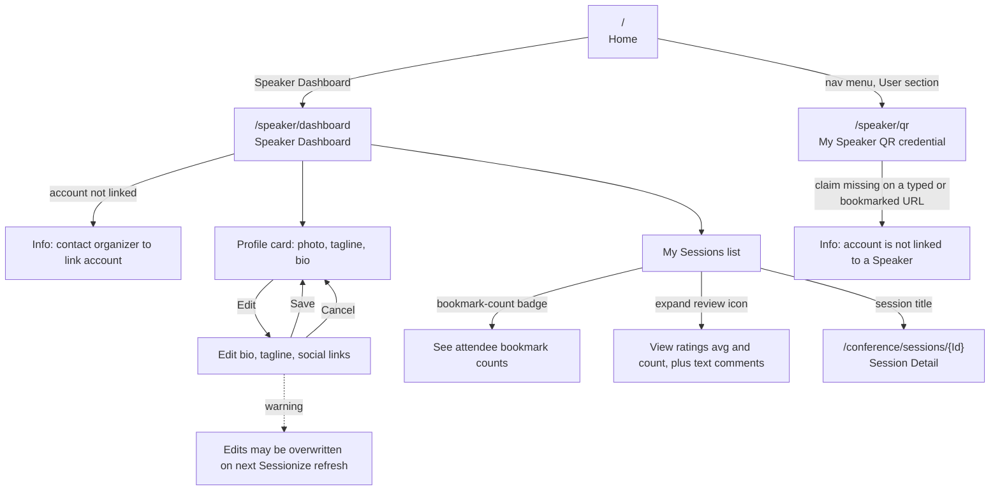
```mermaid
flowchart TD
    Home["/<br/>Home"] -->|Speaker Dashboard| Dash["/speaker/dashboard<br/>Speaker Dashboard"]
    Dash -->|account not linked| NotLinked["Info: contact organizer to link account"]
    Dash --> Profile["Profile card: photo, tagline, bio"]
    Profile -->|Edit| EditProfile["Edit bio, tagline, social links"]
    EditProfile -->|Save| Profile
    EditProfile -->|Cancel| Profile
    EditProfile -.->|warning| Overwrite["Edits may be overwritten on next Sessionize refresh"]
    Dash --> MySessions["My Sessions list"]
    MySessions -->|bookmark-count badge| Counts["See attendee bookmark counts"]
    MySessions -->|expand review icon| Feedback["View ratings avg and count, plus text comments"]
    MySessions -->|session title| SessionDetail["/conference/sessions/{Id}<br/>Session Detail"]
    Home -->|nav menu, User section| Qr["/speaker/qr<br/>My Speaker QR credential"]
    Qr -->|claim missing on a typed or bookmarked URL| QrNotLinked["Info: account is not linked to a Speaker"]
```

### 5.6 Conference-Day Live Layer (ADR-039)

The live layer is the conference-day surface: it appears for any authenticated user, and the
moderation controls appear only for the session's presenter or an Organizer. The client renders
optimistically and the server is the real authority on who may moderate (BR-236).

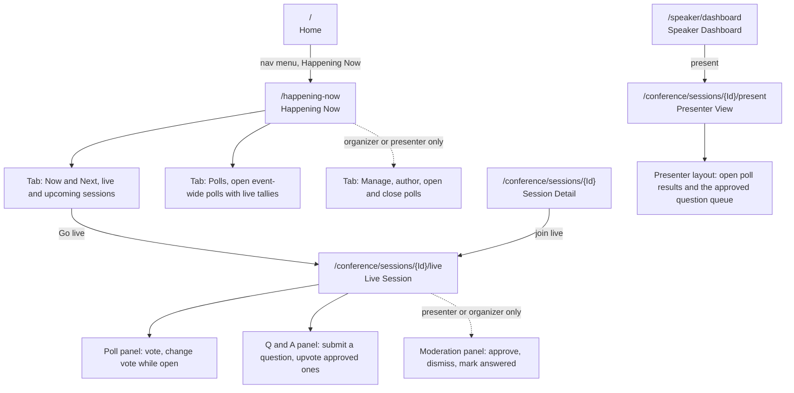
```mermaid
flowchart TD
    Home["/<br/>Home"] -->|nav menu, Happening Now| HN["/happening-now<br/>Happening Now"]

    HN --> NowNext["Tab: Now and Next, live and upcoming sessions"]
    HN --> Polls["Tab: Polls, open event-wide polls with live tallies"]
    HN -.->|organizer or presenter only| Manage["Tab: Manage, author, open and close polls"]

    NowNext -->|Go live| Live["/conference/sessions/{Id}/live<br/>Live Session"]
    SessionDetail2["/conference/sessions/{Id}<br/>Session Detail"] -->|join live| Live

    Live --> LivePolls["Poll panel: vote, change vote while open"]
    Live --> LiveQA["Q and A panel: submit a question, upvote approved ones"]
    Live -.->|presenter or organizer only| Moderate["Moderation panel: approve, dismiss, mark answered"]

    Dash2["/speaker/dashboard<br/>Speaker Dashboard"] -->|present| Present["/conference/sessions/{Id}/present<br/>Presenter View"]
    Present --> PresentPolls["Presenter layout: open poll results and the approved question queue"]
```

### 5.7 Device Settings (MAUI head only)

`/settings/device` ships **only in the MAUI head** (a host-owned page routed via `DeviceUIModule`),
so it can assume native capabilities exist. It is not reachable from the web heads.

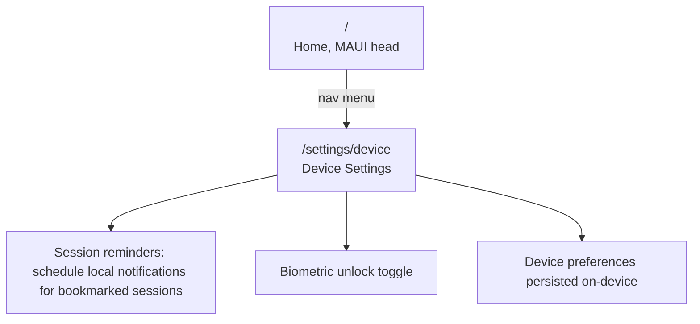
```mermaid
flowchart TD
    MauiHome["/<br/>Home, MAUI head"] -->|nav menu| Device["/settings/device<br/>Device Settings"]
    Device --> Reminders["Session reminders: schedule local notifications for bookmarked sessions"]
    Device --> Biometrics["Biometric unlock toggle"]
    Device --> Prefs["Device preferences persisted on-device"]
```

### 5.8 Scanned QR Landings (deep link only)

Two routable pages have no nav item anywhere: an attendee arrives by pointing a phone at a printed
code. Both need authentication only, and both are safe to rescan.

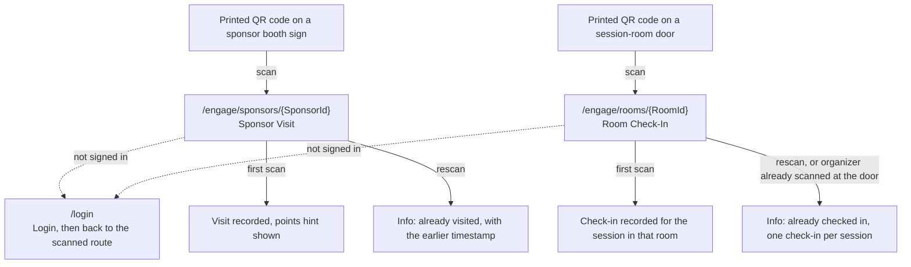
```mermaid
flowchart TD
    Booth["Printed QR code on a sponsor booth sign"] -->|scan| SponsorVisit["/engage/sponsors/{SponsorId}<br/>Sponsor Visit"]
    Door["Printed QR code on a session-room door"] -->|scan| RoomCheckIn["/engage/rooms/{RoomId}<br/>Room Check-In"]

    SponsorVisit -.->|not signed in| Login["/login<br/>Login, then back to the scanned route"]
    RoomCheckIn -.->|not signed in| Login

    SponsorVisit -->|first scan| VisitRecorded["Visit recorded, points hint shown"]
    SponsorVisit -->|rescan| VisitRepeat["Info: already visited, with the earlier timestamp"]

    RoomCheckIn -->|first scan| CheckedIn["Check-in recorded for the session in that room"]
    RoomCheckIn -->|rescan, or organizer already scanned at the door| CheckInRepeat["Info: already checked in, one check-in per session"]
```

### 5.9 Activities

`/conference/activities` is the public, unauthenticated companion to the Organizer activity CRUD
pages. It lists the activities of the selected event and is the only activity route with no
authorization attribute at all; the three management routes are Organizer-only.

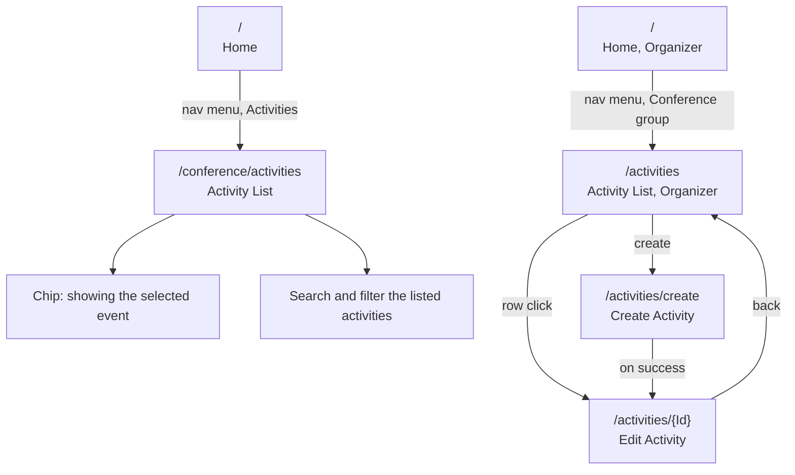
```mermaid
flowchart TD
    Home["/<br/>Home"] -->|nav menu, Activities| PubActivities["/conference/activities<br/>Activity List"]
    PubActivities --> EventChip["Chip: showing the selected event"]
    PubActivities --> Search["Search and filter the listed activities"]
    OrgHome["/<br/>Home, Organizer"] -->|nav menu, Conference group| Manage["/activities<br/>Activity List, Organizer"]
    Manage -->|create| Create["/activities/create<br/>Create Activity"]
    Manage -->|row click| Edit["/activities/{Id}<br/>Edit Activity"]
    Create -->|on success| Edit
    Edit -->|back| Manage
```

---

## Navigation Patterns

### Authentication Redirects
- Unauthenticated users accessing protected pages are redirected to `/login` via the `RedirectToLogin` component.
- Successful login/register redirects to Home (`/`) with a full page reload.
- Logout (from NavMenu, MainLayout, or Profile) redirects to `/login` with a full page reload.
- The "Forgot password?" link on `/login` opens `/forgot-password`. The emailed reset link opens `/reset-password` with the email and token already in the query string (both fields stay editable, so a recipient can paste the token by hand instead), and a successful reset returns to `/login`.

### Authorization Model
- **Roles:** `Organizer` is the only elevated role; every other authenticated user is an `Attendee` (the default). There is no separate "Admin" role.
- **Speaker:** not a role, but an attendee whose account is linked to a Speaker, surfaced as the `speaker_id` JWT claim (auto-linked by email match at registration, or linked manually by an organizer).
- **In-page rights, not route rights:** the live layer gates *panels*, not routes. `/conference/sessions/{Id}/live` is one page for everyone authenticated; the moderation panel renders only when the caller is the session's presenter or an Organizer, and the server re-checks that on every moderation call (BR-236), so the client-side gate is convenience, not security.
- **Menu-driven visibility:** the left nav is built from each module's `IUIModule.NavItems`. Items declare a required role (`Organizer`) or claim (`speaker_id`); the menu hides what the current user can't use. Organizer items sit in the *Admin* nav section (most grouped under "Conference"); "My Profile", the Speaker "Dashboard" and the speaker's "QR" item sit in the *User* section. "Activities" appears twice under two different items: a public one pointing at `/conference/activities` with no requirement, and an Organizer one pointing at `/activities` under the "Conference" admin group. The speaker QR item declares `RequiredClaim: "speaker_id"`, so it is hidden from an attendee whose account is not linked to a Speaker; the page itself carries only `[Authorize]` and answers a typed or bookmarked URL with an explanatory alert rather than an empty card.
- **Page guards (`@attribute [Authorize…]`):**
  - *Organizer role required:* `/sessions/selection-dashboard`, `/events/{EventId}/feedback`, `/sessions/{SessionId}/feedback`, and every conference/user management page (`/events`, `/sessions`, `/speakers`, `/conferencecategories`, `/questions`, `/rooms`, `/users`), each carrying a page-level `[Authorize(Roles = "Organizer")]` (e.g. `EventList.razor`, `UserList.razor`). The shared `Routes.razor` renders the Forbidden page for an authenticated non-Organizer; the inherited `RegisteredUser_AdminPages_ShouldBeForbidden` E2E fact pins this for all seven routes. API-side role enforcement applies as well (defense in depth). The sponsor management pages (`/sponsors`, `/sponsors/create`, `/sponsors/{Id}`), the activity management pages (`/activities`, `/activities/create`, `/activities/{Id}`, each `[Authorize(Roles = "Organizer")]` on `ActivityList.razor`, `ActivityCreate.razor` and `ActivityDetail.razor`) and the check-in and rewards pages (`/check-in`, `/organizer/attendance`, `/organizer/points`) carry the same page-level attribute, and their **writes** are additionally permission-checked API-side (`conference:sponsors:manage`, `engagement:checkin:manage`, `engagement:points:view-overview`), so the role opens the page and the permission authorizes the call.
  - *Authentication only:* `/profile`, `/profile/claims`, `/speaker/dashboard`, `/speaker/qr`, `/my-badge`, `/points`, the two scanned engagement landings (`/engage/sponsors/{SponsorId}`, `/engage/rooms/{RoomId}`), both attendee feedback forms, the conference-day live pages (`/happening-now`, `/conference/sessions/{Id}/live`, `/conference/sessions/{Id}/present`), and `/speakers/{Id}` (SpeakerDetail is the one management page still gated by plain `[Authorize]` because linked speakers edit their own bio there; organizer-only actions on it are enforced API-side).
  - *Public (no attribute):* all `/conference/*` read pages including `/conference/activities` (the public activity list, filtered by the selected event), except the two live-layer routes above, plus the two password-reset pages (`/forgot-password`, `/reset-password`), which ship in the framework UI package and are reachable only by an unauthenticated visitor's own action (the "Forgot password?" link on `/login` or the link in the reset email).
  - *MAUI head only:* `/settings/device` is registered by `DeviceUIModule` and exists in no web head.
- **Deep-link-only routes:** `/engage/sponsors/{SponsorId}` and `/engage/rooms/{RoomId}` contribute no nav item and appear in no menu. An attendee reaches them only by scanning a printed QR code (a sponsor booth sign, a session-room door), and both carry a plain `[Authorize]`, so the scan of an unauthenticated visitor lands on `/login` first. Both are idempotent: a rescan reports the existing visit or check-in as information rather than as an error, and an organizer having already scanned the attendee at the door yields the same one check-in.
- **Feature-gated surfaces:** the badge and check-in pages (`/my-badge`, `/check-in`, `/organizer/attendance`) and the points pages (`/points`, `/organizer/points`) call APIs behind the `Engagement.CheckIn` and `Engagement.Points` flags. With a flag off the controller returns **404** rather than 403 (ADR-031) and the page renders empty; the route itself is not removed.
- **One route, two input surfaces:** `/check-in` renders the camera scan card only where the barcode-scanner capability reports itself supported (the MAUI head, [ADR-071](../adr/071-barcode-scanning-and-qr-display.md)). The manual attendee-search panel is always rendered, so on the web and Windows heads that search *is* the check-in surface rather than a degraded fallback. The page adapts; it does not branch on platform.

### CRUD Pattern (Organizer)
All admin entity management follows the same navigation pattern:
```
List ──row click──► Detail ──back──► List
 │                    ▲
 └──create──► Create ─┘ (on success)
              │
              └──back──► List
```

### Cross-Entity Links (Organizer)
- **Event Detail** links to Speaker Detail and Room Detail for associated entities.
- **Speaker Detail** links to Session Detail for assigned sessions.
- **Session Selection Dashboard** links to Speaker Detail and Session Detail for each analyzed speaker/session.

### Public → Engagement Flow
- **Public Event Detail** and **Public Session Detail** show a "Submit Feedback" button (visible to authenticated users only) that navigates to the corresponding feedback form.
- Feedback forms navigate back to the originating public detail page on cancel.

