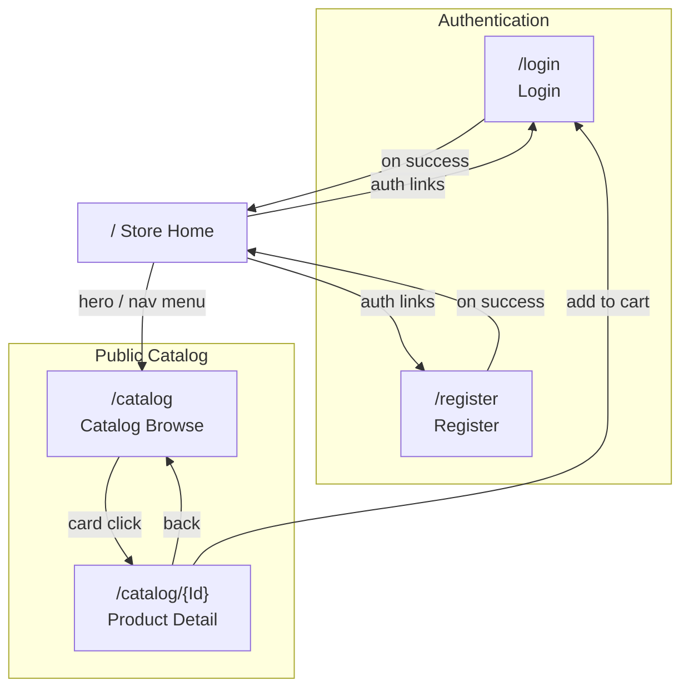
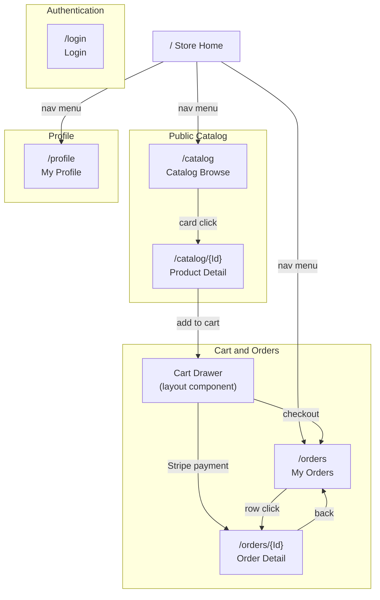

# Navigation Flow

This document maps the site navigation flow for each actor in the MMCA.Store application. Each mermaid diagram shows the pages accessible to that actor and the directional navigation links between them. (Companion to MMCA.ADC's `NavigationFlow.md`; same per-actor format.)

## Actors

| Actor | Access Level | Identification |
|---|---|---|
| **Anonymous** | Public catalog browse + auth pages | Not authenticated |
| **Customer** | Anonymous + profile, cart/checkout, own orders | Authenticated, default `Customer` role (`customer_id` claim) |
| **Admin** | Full access: Catalog/Sales/Identity admin CRUD | Authenticated, `Admin` role |

> **Roles and enforcement:** `Admin` is the only elevated role (registration creates a `Customer`). The 14 admin pages carry page-level `[Authorize(Roles = "Admin")]`, regression-gated in CI by the three per-module `*RouteAuthorizationTests` (`MMCA.Store.CI.slnf:39,45,51`). Customer-facing data is additionally row-scoped server-side (see **Authorization Model** at the end), so the page gate is defense-in-depth, never the boundary.

---

## 1. Anonymous User

Pages accessible without authentication: home, login, register, and the public catalog.

> Add-to-cart on the product detail page sits inside an `AuthorizeView`; an anonymous visitor is prompted to log in instead.

---

## 2. Customer (Authenticated User)

Inherits all anonymous pages. Gains the profile page, the cart drawer (a layout component, not a route), checkout, and their own orders. Unauthenticated visitors deep-linking to these pages are redirected to login (SSR session-cookie auth keeps `[Authorize]` enforced on fresh GETs and F5, ADR-022).

> `/orders` lists only the caller's own orders (ownership `Specification` row-scoping); an admin on the same route sees all orders. The order detail data is ownership-checked server-side with 404-not-403 semantics so foreign order ids do not leak existence. Abandoned Stripe payments are recovered by the `OrphanOrderRecovery` component on return.

---

## 3. Admin

Inherits all customer pages, plus the admin CRUD surfaces for all three modules. Every page below carries `[Authorize(Roles = "Admin")]`; a customer deep-linking to any of them gets Forbidden on both fresh GET and F5.

```mermaid
flowchart TD
    subgraph CatalogAdmin["Catalog Admin"]
        Categories["/categories<br/>Category List"]
        CategoryCreate["/categories/create<br/>Create Category"]
        CategoryDetail["/categories/{Id}<br/>Category Detail"]
        Products["/products<br/>Product List"]
        ProductCreate["/products/create<br/>Create Product"]
        ProductDetailAdm["/products/{Id}<br/>Product Detail"]
    end

    subgraph SalesAdmin["Sales Admin"]
        Inventory["/inventory<br/>Inventory List"]
        InventoryCreate["/inventory/create<br/>Create Inventory Item"]
        InventoryDetail["/inventory/{Id}<br/>Inventory Detail"]
        Carts["/shoppingcarts<br/>Shopping Cart List"]
        CartDetail["/shoppingcarts/{Id}<br/>Shopping Cart Detail"]
        OrdersAll["/orders<br/>All Orders"]
        OrderDetailAdm["/orders/{Id}<br/>Order Detail"]
    end

    subgraph IdentityAdmin["Identity Admin"]
        Customers["/customers<br/>Customer List"]
        CustomerCreate["/customers/create<br/>Create Customer"]
        CustomerDetail["/customers/{Id}<br/>Customer Detail"]
    end

    Home["/  Store Home"]

    Home -->|nav menu| Categories
    Home -->|nav menu| Products
    Home -->|nav menu| Inventory
    Home -->|nav menu| Carts
    Home -->|nav menu| OrdersAll
    Home -->|nav menu| Customers

    Categories -->|row click| CategoryDetail
    Categories -->|create| CategoryCreate
    Products -->|row click| ProductDetailAdm
    Products -->|create| ProductCreate
    Inventory -->|row click| InventoryDetail
    Inventory -->|create| InventoryCreate
    Carts -->|row click| CartDetail
    OrdersAll -->|row click| OrderDetailAdm
    Customers -->|row click| CustomerDetail
    Customers -->|create| CustomerCreate
```

---

## Authorization Model

Three cooperating layers; the API is always the boundary:

1. **Page-level route guards.** The 14 admin pages carry `[Authorize(Roles = "Admin")]` and `/profile` / `/orders` carry `[Authorize]`. SSR session-cookie auth (ADR-022, `mmca_auth_access` HttpOnly cookie) lets these attributes pass on fresh GETs, F5, and new tabs, so deep links never render a protected shell to the wrong actor. Regression-gated by `Catalog/Sales/IdentityRouteAuthorizationTests` in CI (commit `c4adff2`).
2. **API resource ownership (ADR-033).** `OwnerOrAdminFilter` 403s requests whose `customer_id` claim mismatches the owner parameter, and `OwnershipHelper.GetOwnershipSpecification()` row-scopes collection queries so customers only ever receive their own carts/orders. Per-mutation checks on orders return 404-not-403 to avoid leaking existence.
3. **In-page conditionals.** `AuthorizeView` hides customer-only affordances (add-to-cart) from anonymous visitors and admin-only affordances from customers; these are UX sugar on top of layers 1-2, never the enforcement.

Menu items are rendered per-role, so each actor's nav menu contains only the routes shown in their diagram above.
