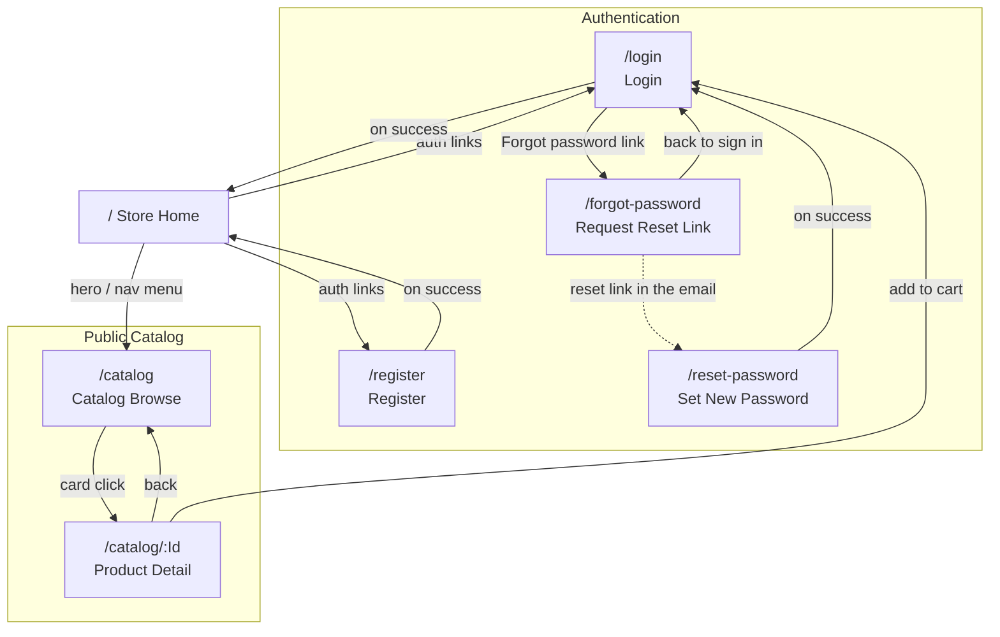
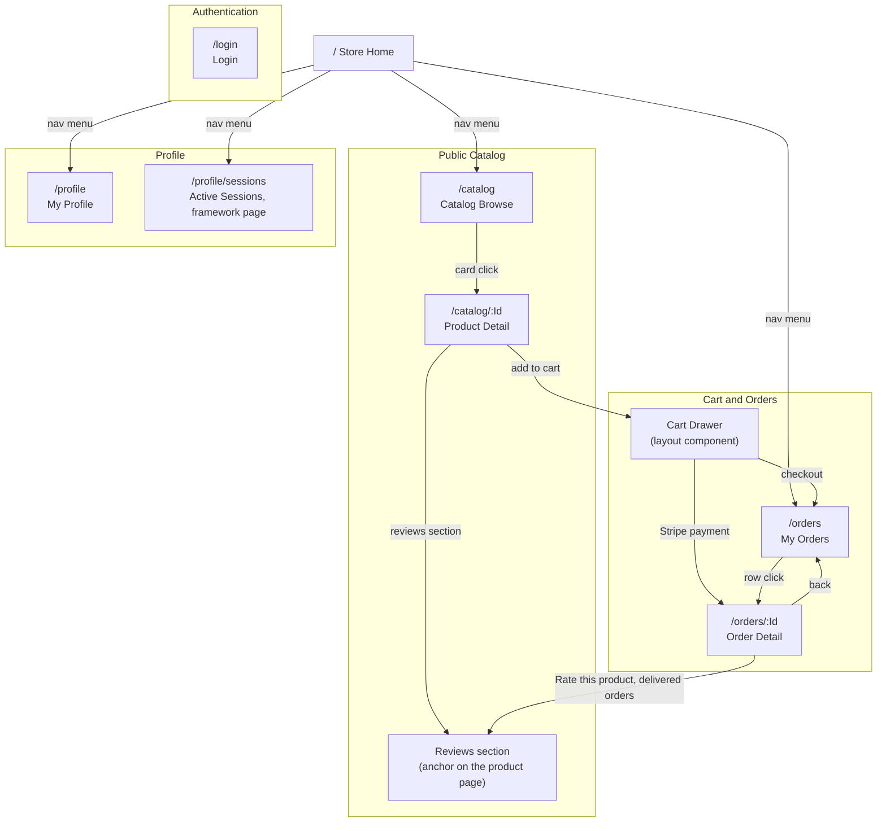

# Navigation Flow

_As of: 2026-09-25._

This document maps the site navigation flow for each actor in the MMCA.Store application. Each mermaid diagram shows the pages accessible to that actor and the directional navigation links between them. (Companion to MMCA.ADC's `NavigationFlow.md`; same per-actor format.)

## Actors

| Actor | Access Level | Identification |
|---|---|---|
| **Anonymous** | Public catalog browse + auth pages | Not authenticated |
| **Customer** | Anonymous + profile, cart/checkout, own orders | Authenticated, default `Customer` role (`customer_id` claim) |
| **Admin** | Full access: Catalog/Sales/Identity admin CRUD | Authenticated, `Admin` role |

> **Roles and enforcement:** `Admin` is the only elevated role (registration creates a `Customer`). The 19 admin pages carry page-level `[Authorize(Roles = "Admin")]`. The three per-module `*RouteAuthorizationTests` (`MMCA.Store.CI.slnf:40,46,52`) regression-gate 17 of them in CI; the `/users` pair sits outside the governed namespaces of the Identity test, which names only `.Pages.Customers` and `.Pages.Roles` (`IdentityRouteAuthorizationTests.cs:26`). Customer-facing data is additionally row-scoped server-side (see **Authorization Model** at the end), so the page gate is defense-in-depth, never the boundary.

---

## 1. Anonymous User

Pages accessible without authentication: home, login, register, the two password-reset pages, and the public catalog.

```mermaid
flowchart TD
    subgraph Auth["Authentication"]
        Login["/login<br/>Login"]
        Register["/register<br/>Register"]
        ForgotPassword["/forgot-password<br/>Request Reset Link"]
        ResetPassword["/reset-password<br/>Set New Password"]
    end

    subgraph Catalog["Public Catalog"]
        Browse["/catalog<br/>Catalog Browse"]
        ProductDetail["/catalog/:Id<br/>Product Detail"]
    end

    Home["/  Store Home"]

    Home -->|hero / nav menu| Browse
    Home -->|auth links| Login
    Home -->|auth links| Register

    Login -->|on success| Home
    Register -->|on success| Home

    Login -->|Forgot password link| ForgotPassword
    ForgotPassword -->|back to sign in| Login
    ForgotPassword -.->|reset link in the email| ResetPassword
    ResetPassword -->|on success| Login

    Browse -->|card click| ProductDetail
    ProductDetail -->|back| Browse
    ProductDetail -->|add to cart| Login
```

> Add-to-cart on the product detail page sits inside an `AuthorizeView`; an anonymous visitor is prompted to log in instead.

> The product detail page carries a reviews section at the anchor `#reviews`, and the browse cards show a star rating. Both are readable anonymously: the published-reviews endpoint is `AllowAnonymous` and output-cached. Only the review editor inside that section is behind an `AuthorizeView`.

> `/forgot-password` and `/reset-password` are shipped by the framework UI package and carry no `[Authorize]` attribute. The dashed edge is the reset email: the link carries the email and the token in the query string, and both fields stay editable so a recipient can paste the token by hand.

---

## 2. Customer (Authenticated User)

Inherits all anonymous pages. Gains the profile page, the cart drawer (a layout component, not a route), checkout, and their own orders. Unauthenticated visitors deep-linking to these pages are redirected to login (SSR session-cookie auth keeps `[Authorize]` enforced on fresh GETs and F5, ADR-022).

```mermaid
flowchart TD
    subgraph Auth["Authentication"]
        Login["/login<br/>Login"]
    end

    subgraph Catalog["Public Catalog"]
        Browse["/catalog<br/>Catalog Browse"]
        ProductDetail["/catalog/:Id<br/>Product Detail"]
        Reviews["Reviews section<br/>(anchor on the product page)"]
    end

    subgraph Sales["Cart and Orders"]
        Cart["Cart Drawer<br/>(layout component)"]
        Orders["/orders<br/>My Orders"]
        OrderDetail["/orders/:Id<br/>Order Detail"]
    end

    subgraph Identity["Profile"]
        Profile["/profile<br/>My Profile"]
        Sessions["/profile/sessions<br/>Active Sessions, framework page"]
    end

    Home["/  Store Home"]

    Home -->|nav menu| Browse
    Home -->|nav menu| Orders
    Home -->|nav menu| Profile
    Home -->|nav menu| Sessions

    Browse -->|card click| ProductDetail
    ProductDetail -->|add to cart| Cart
    Cart -->|checkout| Orders
    Cart -->|Stripe payment| OrderDetail

    Orders -->|row click| OrderDetail
    OrderDetail -->|back| Orders

    ProductDetail -->|reviews section| Reviews
    OrderDetail -->|Rate this product, delivered orders| Reviews
```

> A delivered order's lines carry a "Rate this product" link to that product's reviews anchor, which is the shortest path from "my parcel arrived" to writing the review the delivery entitled the customer to. The editor inside the section still checks eligibility server-side (`GET /Reviews/by-product/{productId}/mine`), so the link is a shortcut, never the authorization.

> `/orders` lists only the caller's own orders (ownership `Specification` row-scoping); an admin on the same route sees all orders. The order detail data is ownership-checked server-side with 404-not-403 semantics so foreign order ids do not leak existence. Abandoned Stripe payments are recovered by the `OrphanOrderRecovery` component on return.

---

## 3. Admin

Inherits all customer pages, plus the admin CRUD surfaces for all three modules and the user and role administration pages. Every page below except the shared `/orders` pair (see the customer section) carries `[Authorize(Roles = "Admin")]`; a customer deep-linking to any of them gets Forbidden on both fresh GET and F5.

```mermaid
flowchart TD
    subgraph CatalogAdmin["Catalog Admin"]
        Categories["/categories<br/>Category List"]
        CategoryCreate["/categories/create<br/>Create Category"]
        CategoryDetail["/categories/:Id<br/>Category Detail"]
        Products["/products<br/>Product List"]
        ProductCreate["/products/create<br/>Create Product"]
        ProductDetailAdm["/products/:Id<br/>Product Detail"]
        ReviewsAdm["/reviews<br/>Review Moderation"]
    end

    subgraph SalesAdmin["Sales Admin"]
        Inventory["/inventory<br/>Inventory List"]
        InventoryCreate["/inventory/create<br/>Create Inventory Item"]
        InventoryDetail["/inventory/:Id<br/>Inventory Detail"]
        Carts["/shoppingcarts<br/>Shopping Cart List"]
        CartDetail["/shoppingcarts/:Id<br/>Shopping Cart Detail"]
        OrdersAll["/orders<br/>All Orders"]
        OrderDetailAdm["/orders/:Id<br/>Order Detail"]
    end

    subgraph IdentityAdmin["Identity Admin"]
        Customers["/customers<br/>Customer List"]
        CustomerCreate["/customers/create<br/>Create Customer"]
        CustomerDetail["/customers/:Id<br/>Customer Detail"]
        Users["/users<br/>User Management"]
        UserDetail["/users/:Id<br/>User Detail"]
        Roles["/roles<br/>Role Administration"]
        RoleEdit["/roles/:Role<br/>Role Permission Editor"]
    end

    Home["/  Store Home"]

    Home -->|nav menu| Categories
    Home -->|nav menu| Products
    Home -->|nav menu| ReviewsAdm
    Home -->|nav menu| Inventory
    Home -->|nav menu| Carts
    Home -->|nav menu| OrdersAll
    Home -->|nav menu| Customers
    Home -->|nav menu| Users
    Home -->|nav menu, capability gated| Roles

    Categories -->|row click| CategoryDetail
    Categories -->|create| CategoryCreate
    Products -->|row click| ProductDetailAdm
    Products -->|create| ProductCreate
    Inventory -->|row click| InventoryDetail
    Inventory -->|create| InventoryCreate
    Carts -->|row click| CartDetail
    OrdersAll -->|row click| OrderDetailAdm
    Customers -->|row click| CustomerDetail
    Customers -->|create| CustomerCreate
    ReviewsAdm -->|reviewed product| ProductDetailAdm
    Users -->|row click| UserDetail
    Roles -->|edit role| RoleEdit
    RoleEdit -->|back| Roles
```

> The admin order detail page opens `ShipOrderDialog` for both shipment actions: "Ship order" on a Paid order and "Edit tracking" on a Shipped one. One dialog instance serves both, and the summary panel picks the endpoint. It is a dialog rather than a route, so it does not appear as a node above.

> `/reviews` is the moderation grid: every review whatever its status, with hide and unhide. The page carries the Admin route guard, and the endpoints behind it carry the finer-grained `catalog:reviews:moderate` permission, which today only the Admin role holds.

> `/users`, `/users/{Id}`, `/roles` and `/roles/{Role}` are Store pages in the Identity UI module whose roster, operator actions and permission editor come from the framework's shared administration components (`UserAdminList` at `UserList.razor:12`, `RoleAdminList` at `RoleList.razor:10`, `RoleAdminEdit` at `RoleEdit.razor:10`; ADR-116). Each carries `[Authorize(Roles = "Admin")]` (`:2` on the two role pages, `:5` on the two user pages). The Users nav item is gated on the Admin role (`IdentityUIModule.cs:23`); the Roles item is gated on the `roles:manage` capability rather than on a role (`IdentityUIModule.cs:29-35`), because the screen exists to change the role-to-capability map. Store types the detail route as `/users/{Id}` with no `:int` constraint (`UserDetail.razor:1`).

---

## Authorization Model

Three cooperating layers; the API is always the boundary:

1. **Page-level route guards.** The 19 admin pages carry `[Authorize(Roles = "Admin")]` and `/profile` / `/orders` carry `[Authorize]`. SSR session-cookie auth (ADR-022, `mmca_auth_access` HttpOnly cookie) lets these attributes pass on fresh GETs, F5, and new tabs, so deep links never render a protected shell to the wrong actor. Regression-gated by `Catalog/Sales/IdentityRouteAuthorizationTests` in CI (commit `c4adff2`) for every admin page except the `/users` pair, which the Identity test's namespace list does not name (`IdentityRouteAuthorizationTests.cs:26`).
2. **API resource ownership (ADR-033).** `OwnerOrAdminFilter` 403s requests whose `customer_id` claim mismatches the owner parameter, and `OwnershipHelper.GetOwnershipSpecification()` row-scopes collection queries so customers only ever receive their own carts/orders. Per-mutation checks on orders return 404-not-403 to avoid leaking existence.
3. **In-page conditionals.** `AuthorizeView` hides customer-only affordances (add-to-cart) from anonymous visitors and admin-only affordances from customers; these are UX sugar on top of layers 1-2, never the enforcement.

Menu items are rendered per role (the Roles item per capability), so each actor's nav menu contains only the routes shown in their diagram above, plus the framework-owned routes below, which the shared `MMCA.Common.UI` shell contributes to every host.

**Framework-owned routes.** These routes come from the `MMCA.Common.UI` package rather than from a Store module; the UI host routes that assembly alongside its own (`UI.Web/Program.cs:266-267`):

- `/profile/sessions` (active refresh sessions) is rendered in the nav for every signed-in user, Customer and Admin alike, by the framework `NavMenu` (`MMCA.Common.UI/Layout/NavMenu.razor:83-86`); a host can restrict the link to one role with `Layout:SessionsNavRequiredRole` (read at `NavMenu.razor:214-215`), which Store deliberately leaves unset so customers can review and revoke their own sessions.
- `/confirm-email` is the anonymous email-confirmation landing page (`MMCA.Common.UI/Pages/Auth/ConfirmEmail.razor:1`, `[AllowAnonymous]` at `:3`). Store serves the framework page rather than a copy of its own (Store commit `65b53f5a`), and the Identity service points the confirmation link at it (`ConfirmationUrl`, `Identity.Service/appsettings.json:116`). It has no nav item: a visitor reaches it only from the link in the confirmation email.
- `/notifications`, `/notifications/inbox` (with `/notifications/inbox/{Id:int}`) and `/notifications/send` ship in the same package, each behind a bare `[Authorize]` (`NotificationList.razor:5`, `NotificationInbox.razor:5`, `NotificationSend.razor:6`), so they are routable by URL for any signed-in user, but Store registers no notification services, so they have no nav item and are not a supported Store surface; hiding them needs a framework-side feature gate, tracked as a [C->A] item.
