# MMCA Concept & Pattern Maps

Mermaid diagrams distilled from the [Onboarding guide](00-index.md) (primer, group taxonomy,
dependency manifest, and the 26 group chapters). Each diagram captures a *relationship* between the
concepts the guide teaches: the layering, the 26 functional groups, the cross-cutting patterns, and
the ADRs (see `MMCA.Common/ADRs/README.md` for the canonical range) / rubric categories that explain the "why".

Diagrams are grounded in:
[`00-primer.md`](00-primer.md) · [`00-group-taxonomy.md`](00-group-taxonomy.md) ·
[`00-dependency-manifest.md`](00-dependency-manifest.md) · the `group-NN-*.md` chapters.

---

## 1. System context, two codebases + the 13 packages

`MMCA.Common` is a framework published as thirteen NuGet packages in lockstep; `MMCA.ADC` and
`MMCA.Store` consume them. The framework depends on neither consumer (that one-way arrow is why the
Common groups come first in the guide).

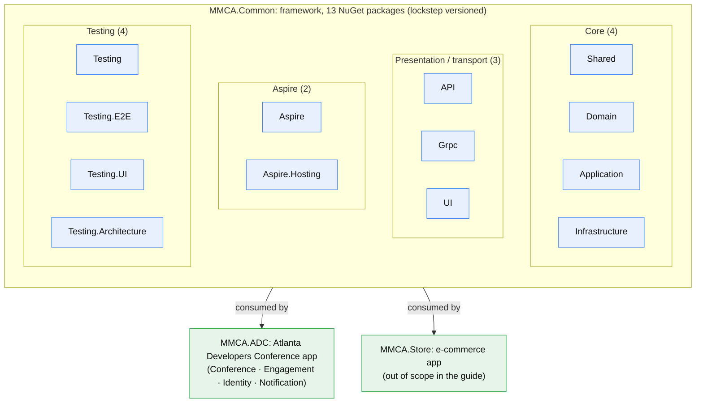

---

## 2. Clean Architecture, the layered dependency rule

Source dependencies point **inward** toward the Domain; each layer references only layers below it.
Two deliberate exceptions: `UI` and `Grpc` depend on `Shared` **only** (UI for Blazor WASM
compatibility, Grpc because it is pure transport). Enforced twice: a compile-time MSBuild layer guard
**and** NetArchTest fitness tests ([ADR-015](https://ivanball.github.io/docs/adr/015-architecture-fitness-functions.html)).

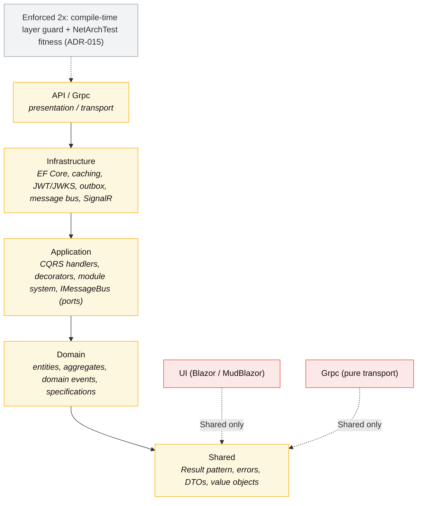

---

## 3. The 25 functional groups, dependency / build order

The primary axis of the guide: every type lives in exactly one of 25 groups, ordered roughly
**topologically**. Foundational, widely-depended-on concerns first (Result → domain blocks →
querying → events → CQRS → …), then the ASP.NET/UI/Aspire edges, then the ADC business modules, then
the test infrastructure. Arrows show the dominant "builds on" direction (charters + levels).

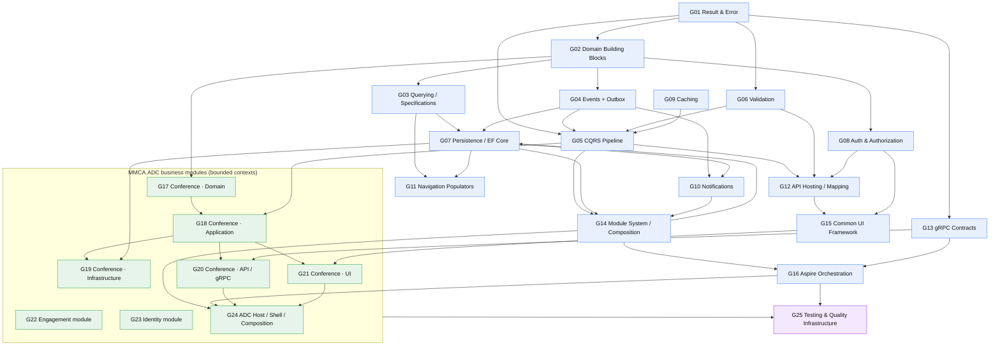

---

## 4. Core framework patterns, how the building blocks compose

The pattern-level view of the same backbone: the ideas the primer commits to and how they feed each
other. `Result` is the pervasive currency; DDD blocks produce domain events; events feed the outbox;
commands/queries flow through the decorator pipeline; persistence writes both entity and outbox in
one transaction.

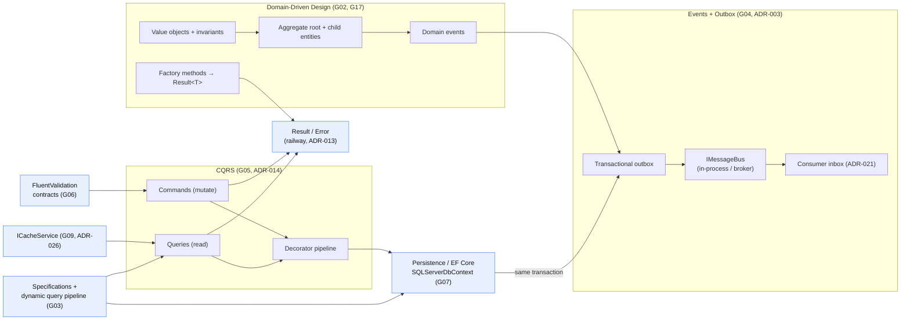

---

## 5. Request lifecycle, the CQRS decorator pipeline ([ADR-014](https://ivanball.github.io/docs/adr/014-cqrs-decorator-pipeline.html))

Handlers are thin (one method); every cross-cutting concern is a decorator wrapping the next. Scrutor
`TryDecorate` composes them; the **execution order is load-bearing**:
FeatureGate → Logging → Caching → Validating → Transactional → Handler. Opt-in marker interfaces let
a handler switch each concern on.

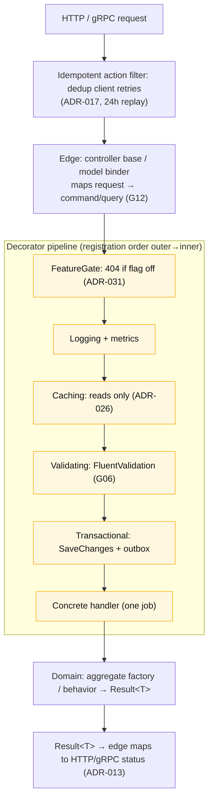

---

## 6. Event-driven integration, outbox dual-dispatch ([ADR-003](https://ivanball.github.io/docs/adr/003-outbox-dual-dispatch.html) / 010 / 021)

Domain events are captured into an `OutboxMessage` row **in the same transaction** as the data
(no dual-write bug). A background processor drains the outbox and dispatches both in-process and over
the broker; every integration event carries a `SchemaVersion`; consumers dedup by `MessageId` via an
inbox.

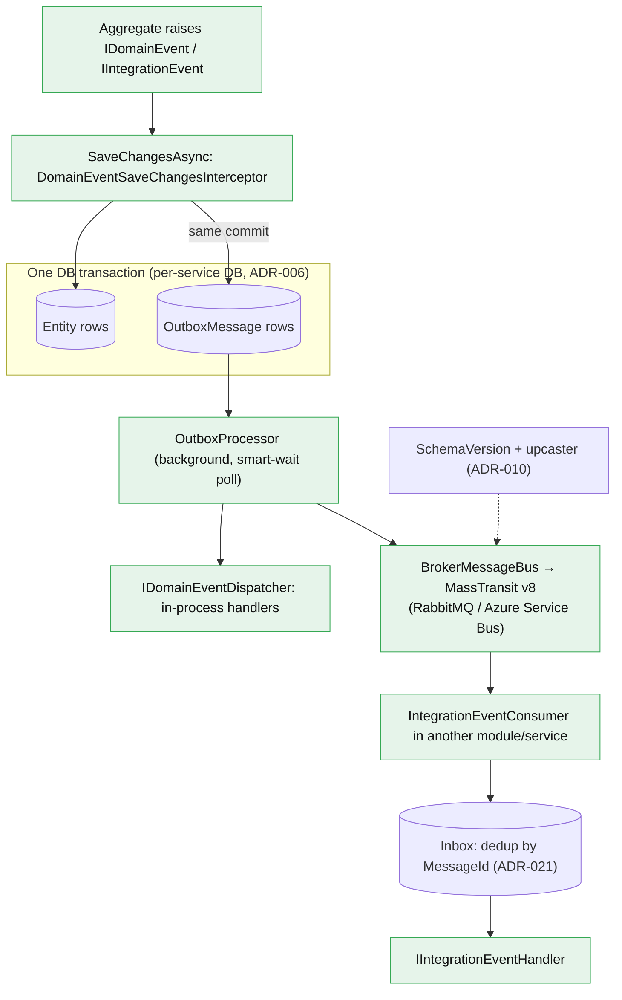

---

## 7. Modular monolith → extractable services ([ADR-006](https://ivanball.github.io/docs/adr/006-database-per-service.html) / 007 / 008 / 012)

Modules implement `IModule` and are discovered + Kahn-ordered by `ModuleLoader`. The **same module
code** runs as a single monolith host or as N service processes behind a YARP gateway, because
application code talks to abstractions (`IMessageBus`, typed gRPC clients) and transport lives at the
edges.

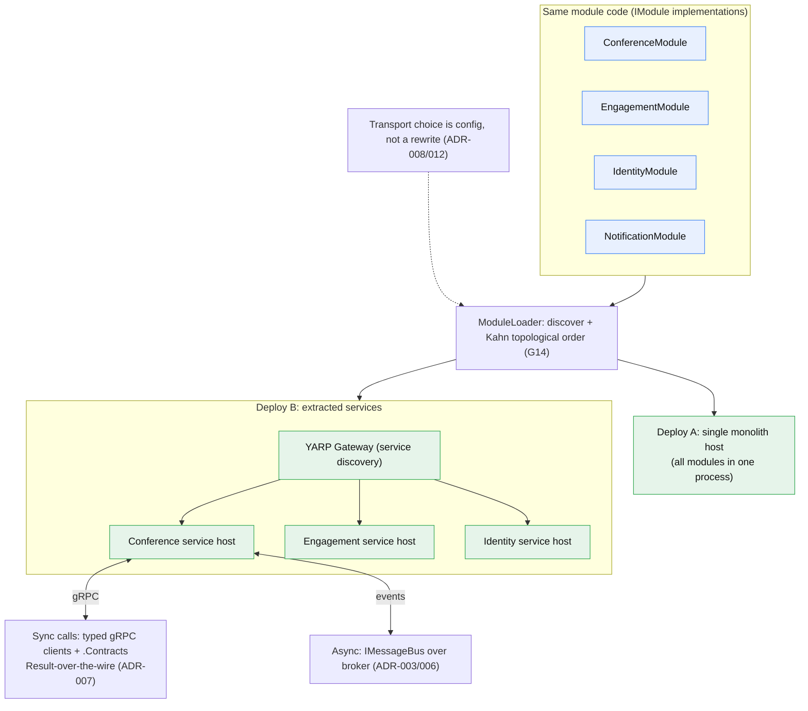

---

## 8. Persistence, database-per-service + polyglot engines ([ADR-006](https://ivanball.github.io/docs/adr/006-database-per-service.html) / 018 / 030)

One concrete `SQLServerDbContext` over the abstract `ApplicationDbContext`, **one instance per
database**. Each entity is engine-agnostic; a single `[UseDataSource(engine)]` attribute on its
config class picks SQL Server, Cosmos, or SQLite. Cross-source relationships auto-degrade; the outbox
is the cross-source consistency mechanism. Each service self-applies its EF migrations at boot
([ADR-030](https://ivanball.github.io/docs/adr/030-startup-sole-migrator.html)).

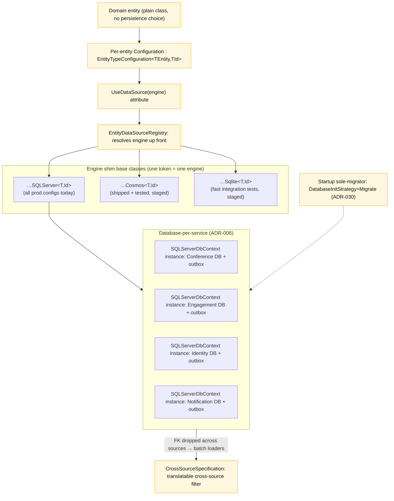

---

## 9. Authentication & Authorization stack

The auth concern (G08) spans token validation, session cookies, password hashing, brute-force
protection, and a layered authorization model: RBAC roles → opt-in permissions → resource ownership.

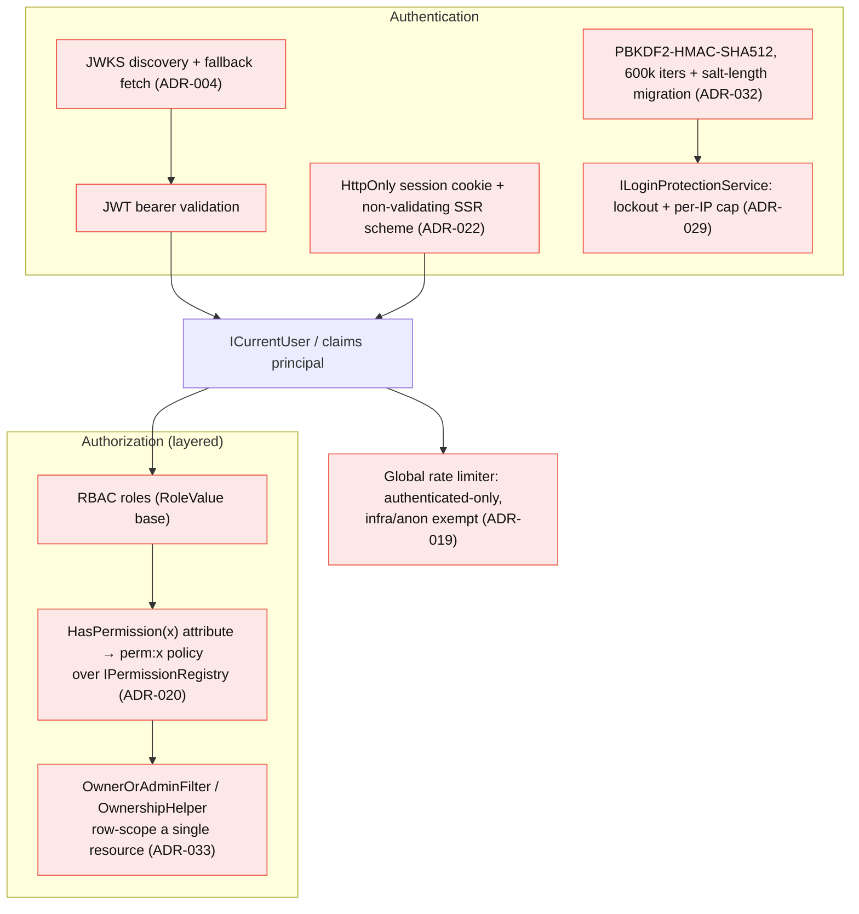

---

## 10. Notifications, two channels behind one sender ([ADR-024](https://ivanball.github.io/docs/adr/024-push-notifications.html))

A durable in-app inbox **and** a transient SignalR push, both behind `IPushNotificationSender`, plus
email. Recipient providers resolve who gets notified; the thin `MMCA.ADC.Notification` module hosts
it.

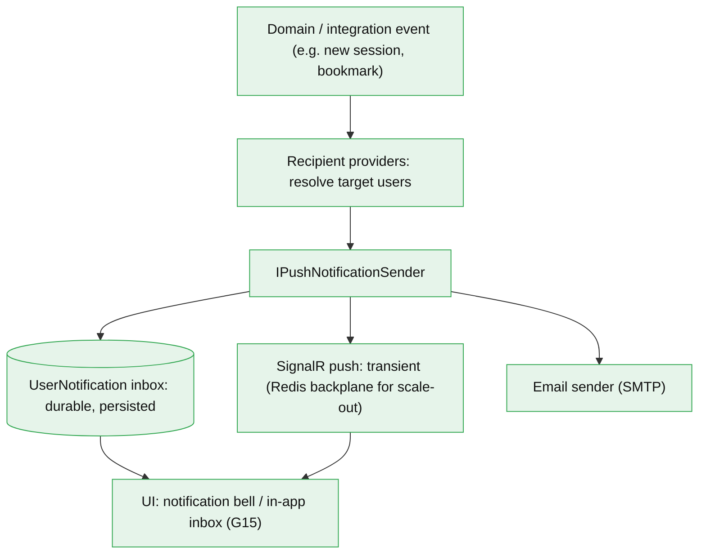

---

## 11. UI, write-once render everywhere + i18n + theming

A page is authored **once** as a Razor component in a per-module UI library; both the Blazor web host
(Server + WASM) and the .NET MAUI host reference the same libraries, so it renders across Web,
Android, iOS, macOS, Windows. Culture cookie + `IStringLocalizer` drive i18n ([ADR-027](https://ivanball.github.io/docs/adr/027-multi-locale-i18n.html)); `ThemeService`
drives day/dark ([ADR-028](https://ivanball.github.io/docs/adr/028-dark-theme-mode.html)).

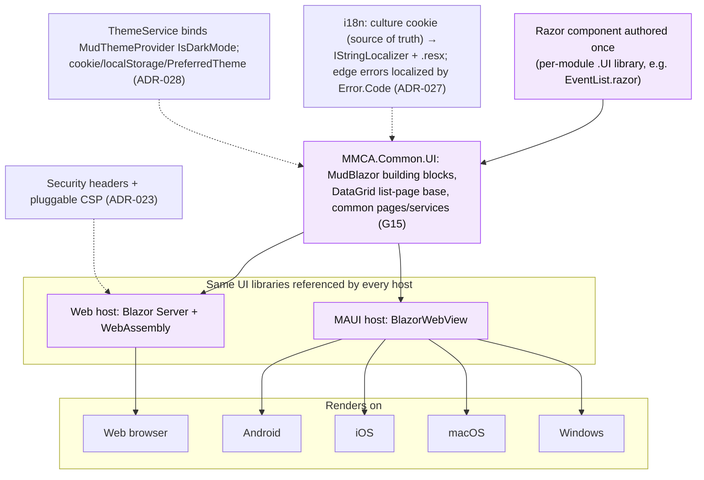

---

## 12. ADC business modules, bounded contexts end-to-end

Each ADC module is a vertical slice through all layers. Conference is large enough to split across
five chapters (G17-G21); Engagement and Identity are one chapter each; Notification is the thin host
over the Common notifications capability.

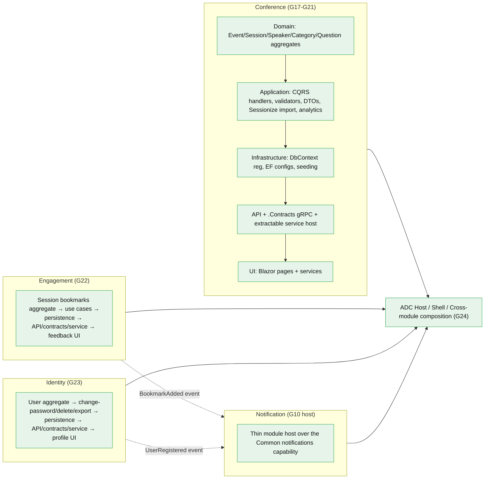

---

## 13. The 34 ADRs, grouped by theme

Every accepted ADR in `MMCA.Common/ADRs/`, clustered by the concern it governs. (011 is struck
through: superseded by 027.)

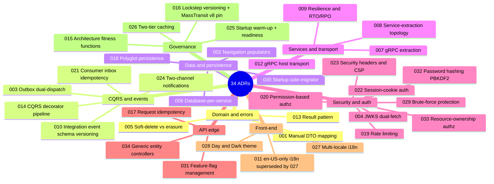

---

## 14. The 34-category evaluation rubric

The lens the guide tags code against (`[Rubric §N]`). Scored on two axes: **Maturity** (0-4, process)
and **Implementation** (0-10, substance). Three parts.

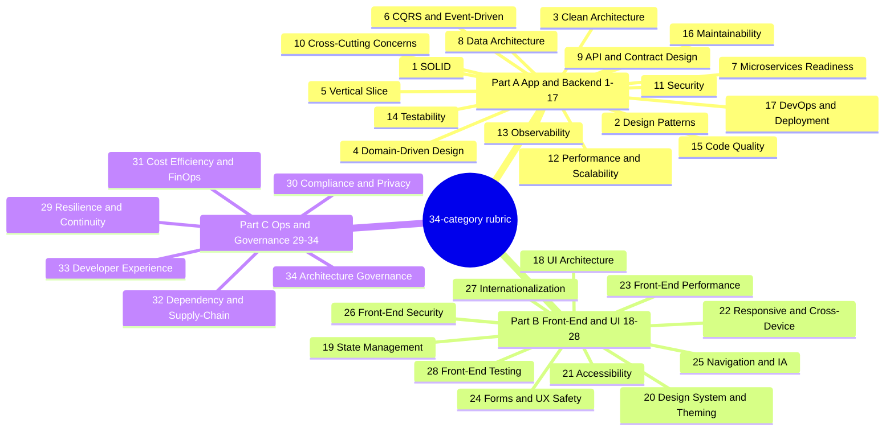

---

## 15. How the axes fit together (reading map)

The guide is organized on **two axes at once**. This ties the diagrams above back to the guide's
navigation.

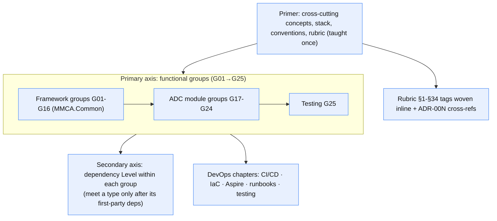

---

### Notes on fidelity

- Group-to-group arrows in §3 show the **dominant** "builds on" direction from the charters and Level
  ranges in [`00-group-taxonomy.md`](00-group-taxonomy.md); the guide allows forward references where
  functional cohesion outranks strict layering, so a few minor edges are omitted for readability.
- Pattern diagrams (§4-§12) reflect the mechanisms as taught in the corresponding `group-NN-*.md`
  chapters and the ADRs named in [`00-primer.md`](00-primer.md).
- The 14 dependency cycles (SCCs) noted in the manifest are kept whole inside a single group
  (e.g. the `ApplicationDbContext` ↔ interceptors cycle in G07, the Conference aggregate nav-cycles in
  G17); they are not drawn as separate nodes here.
