# MMCA Concept & Pattern Maps

Mermaid diagrams distilled from the [Onboarding guide](00-index.md) (primer, group taxonomy,
dependency manifest, and the 27 group chapters). Each diagram captures a *relationship* between the
concepts the guide teaches: the layering, the 27 functional groups, the cross-cutting patterns, and
the ADRs (see `Website/docs-src/adr/README.md` for the canonical range) / rubric categories that explain the "why".

Diagrams are grounded in:
[`00-primer.md`](00-primer.md) · [`00-group-taxonomy.md`](00-group-taxonomy.md) ·
[`00-dependency-manifest.md`](00-dependency-manifest.md) · the `group-NN-*.md` chapters.

---

## 1. System context, two codebases + the 15 packages

`MMCA.Common` is a framework published as fifteen NuGet packages in lockstep, to nuget.org **and**
GitHub Packages from one tag ([ADR-053](https://ivanball.github.io/docs/adr/053-dual-registry-package-publishing.html));
`MMCA.ADC` and `MMCA.Store` consume them. The framework depends on neither consumer (that one-way
arrow is why the Common groups come first in the guide). `UI.Maui` is the one MAUI-TFM package: it
lives outside `MMCA.Common.slnx` and is built and packed by dedicated windows CI jobs
([ADR-042](https://ivanball.github.io/docs/adr/042-device-capability-abstraction.html)).

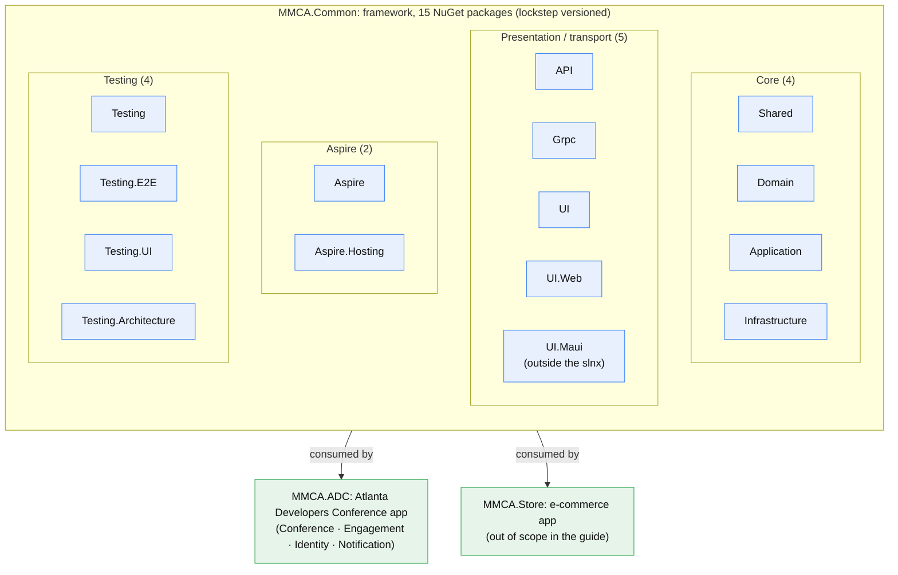
```mermaid
flowchart TD
    subgraph COMMON["MMCA.Common: framework, 15 NuGet packages (lockstep versioned)"]
        direction TB
        subgraph CORE["Core (4)"]
            SH["Shared"]
            DOM["Domain"]
            APP["Application"]
            INF["Infrastructure"]
        end
        subgraph PRES["Presentation / transport (5)"]
            API["API"]
            GRPC["Grpc"]
            UI["UI"]
            UIW["UI.Web"]
            UIM["UI.Maui<br/>(outside the slnx)"]
        end
        subgraph ASP["Aspire (2)"]
            ASPIRE["Aspire"]
            ASPH["Aspire.Hosting"]
        end
        subgraph TEST["Testing (4)"]
            T1["Testing"]
            T2["Testing.E2E"]
            T3["Testing.UI"]
            T4["Testing.Architecture"]
        end
    end

    ADC["MMCA.ADC: Atlanta Developers Conference app<br/>(Conference · Engagement · Identity · Notification)"]
    STORE["MMCA.Store: e-commerce app<br/>(out of scope in the guide)"]

    COMMON -->|"consumed by"| ADC
    COMMON -->|"consumed by"| STORE

    classDef fw fill:#e8f0fe,stroke:#4285f4,color:#111
    classDef con fill:#e6f4ea,stroke:#34a853,color:#111
    class SH,DOM,APP,INF,API,GRPC,UI,UIW,UIM,ASPIRE,ASPH,T1,T2,T3,T4 fw
    class ADC,STORE con
```

---

## 2. Clean Architecture, the layered dependency rule

Source dependencies point **inward** toward the Domain; each layer references only layers below it.
Deliberate exceptions: `UI` and `Grpc` depend on `Shared` **only** (UI for Blazor WASM compatibility,
Grpc because it is pure transport, and `Aspire` in fact references only `Shared` too); `UI.Maui` may
reference `UI` and `Shared` only; and `UI.Web`, the Blazor Web host bridge, sits above `UI`, `API`
and `Aspire`, with transitive project references disabled so the guard can tell a deliberate direct
reference from an inherited one. Enforced twice: the compile-time MSBuild layer guard in
`Source/Build/MMCA.Common.LayerEnforcement.targets`, which carries a target per guarded project
(Shared, Domain, Application, Infrastructure, UI, UI.Maui, UI.Web) and fails the build on a
forbidden `ProjectReference`, **and** NetArchTest fitness tests that re-assert the same rules against
compiled assemblies ([ADR-015](https://ivanball.github.io/docs/adr/015-architecture-fitness-functions.html)).

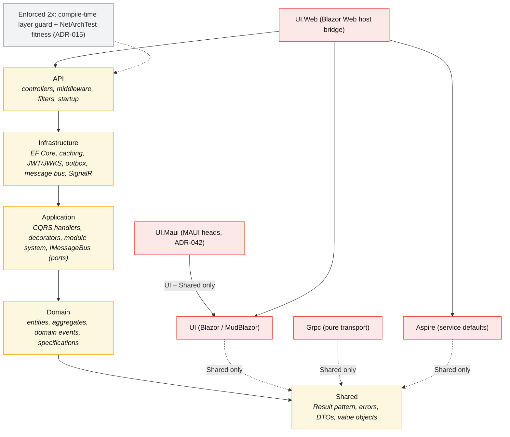
```mermaid
flowchart TD
    APIL["API<br/><i>controllers, middleware, filters, startup</i>"]
    INFL["Infrastructure<br/><i>EF Core, caching, JWT/JWKS, outbox, message bus, SignalR</i>"]
    APPL["Application<br/><i>CQRS handlers, decorators, module system, IMessageBus (ports)</i>"]
    DOML["Domain<br/><i>entities, aggregates, domain events, specifications</i>"]
    SHRL["Shared<br/><i>Result pattern, errors, DTOs, value objects</i>"]
    UIL["UI (Blazor / MudBlazor)"]
    GRPCL["Grpc (pure transport)"]
    ASPL["Aspire (service defaults)"]
    UIMA["UI.Maui (MAUI heads, ADR-042)"]
    UIWB["UI.Web (Blazor Web host bridge)"]

    APIL --> INFL --> APPL --> DOML --> SHRL
    UIL -.->|"Shared only"| SHRL
    GRPCL -.->|"Shared only"| SHRL
    ASPL -.->|"Shared only"| SHRL
    UIMA -->|"UI + Shared only"| UIL
    UIWB --> UIL
    UIWB --> APIL
    UIWB --> ASPL

    ENF["Enforced 2x: compile-time layer guard + NetArchTest fitness (ADR-015)"]
    ENF -.-> APIL

    classDef layer fill:#fef7e0,stroke:#f9ab00,color:#111
    classDef exc fill:#fce8e6,stroke:#ea4335,color:#111
    classDef note fill:#f1f3f4,stroke:#9aa0a6,color:#333
    class APIL,INFL,APPL,DOML,SHRL layer
    class UIL,GRPCL,ASPL,UIMA,UIWB exc
    class ENF note
```

---

## 3. The 27 functional groups, dependency / build order

The primary axis of the guide: every type lives in exactly one of 27 chapter groups, ordered roughly
**topologically**. Foundational, widely-depended-on concerns first (Result → domain blocks →
querying → events → CQRS → …), then the ASP.NET/UI/Aspire edges, then the ADC business modules, then
the late-added Common device-capability layer and the test infrastructure. Arrows show the dominant
"builds on" direction (charters + levels).

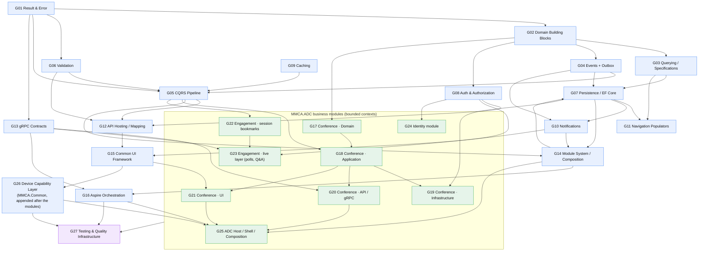
```mermaid
flowchart TD
    G01["G01 Result &amp; Error"]
    G02["G02 Domain Building Blocks"]
    G03["G03 Querying / Specifications"]
    G04["G04 Events + Outbox"]
    G05["G05 CQRS Pipeline"]
    G06["G06 Validation"]
    G07["G07 Persistence / EF Core"]
    G08["G08 Auth &amp; Authorization"]
    G09["G09 Caching"]
    G10["G10 Notifications"]
    G11["G11 Navigation Populators"]
    G12["G12 API Hosting / Mapping"]
    G13["G13 gRPC Contracts"]
    G14["G14 Module System / Composition"]
    G15["G15 Common UI Framework"]
    G16["G16 Aspire Orchestration"]

    subgraph ADCMOD["MMCA.ADC business modules (bounded contexts)"]
        direction TB
        G17["G17 Conference · Domain"]
        G18["G18 Conference · Application"]
        G19["G19 Conference · Infrastructure"]
        G20["G20 Conference · API / gRPC"]
        G21["G21 Conference · UI"]
        G22["G22 Engagement · session bookmarks"]
        G23["G23 Engagement · live layer (polls, Q&amp;A)"]
        G24["G24 Identity module"]
        G25["G25 ADC Host / Shell / Composition"]
    end

    G26["G26 Device Capability Layer<br/>(MMCA.Common, appended after the modules)"]
    G27["G27 Testing &amp; Quality Infrastructure"]

    %% framework backbone
    G01 --> G02 --> G03
    G01 --> G06
    G02 --> G04
    G01 --> G05
    G04 --> G05
    G06 --> G05
    G09 --> G05
    G03 --> G07
    G04 --> G07
    G02 --> G08
    G05 --> G12
    G06 --> G12
    G08 --> G12
    G03 --> G11
    G07 --> G11
    G04 --> G10
    G07 --> G10
    G01 --> G13
    G14 --> G07
    G12 --> G15
    G08 --> G15
    G15 --> G26

    %% edges into composition + orchestration
    G05 --> G14
    G07 --> G14
    G10 --> G14
    G14 --> G16
    G13 --> G16

    %% ADC builds on the framework
    G02 --> G17
    G17 --> G18
    G05 --> G18
    G18 --> G19
    G07 --> G19
    G18 --> G20
    G13 --> G20
    G18 --> G21
    G15 --> G21
    G05 --> G22
    G22 --> G23
    G10 --> G23
    G13 --> G23
    G08 --> G24
    G14 --> G25
    G16 --> G25
    G20 --> G25
    G21 --> G25
    G26 --> G25

    %% everything is tested
    ADCMOD --> G27
    G16 --> G27
    G26 --> G27

    classDef fw fill:#e8f0fe,stroke:#4285f4,color:#111
    classDef adc fill:#e6f4ea,stroke:#34a853,color:#111
    classDef test fill:#f3e8fd,stroke:#a142f4,color:#111
    class G01,G02,G03,G04,G05,G06,G07,G08,G09,G10,G11,G12,G13,G14,G15,G16,G26 fw
    class G17,G18,G19,G20,G21,G22,G23,G24,G25 adc
    class G27 test
```

---

## 4. Core framework patterns, how the building blocks compose

The pattern-level view of the same backbone: the ideas the primer commits to and how they feed each
other. `Result` is the pervasive currency; DDD blocks produce domain events; events feed the outbox;
commands/queries flow through the decorator pipeline; persistence writes both entity and outbox in
one transaction.

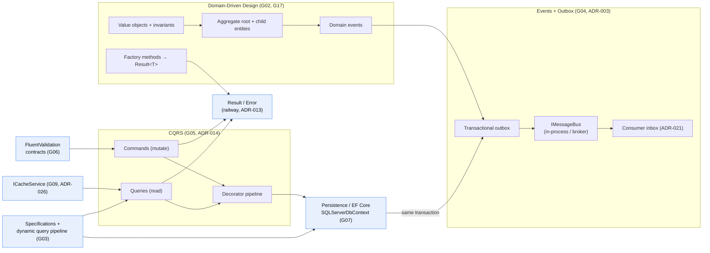
```mermaid
flowchart LR
    RESULT["Result / Error<br/>(railway, ADR-013)"]

    subgraph DDD["Domain-Driven Design (G02, G17)"]
        AGG["Aggregate root + child entities"]
        VO["Value objects + invariants"]
        FACT["Factory methods → Result&lt;T&gt;"]
        DE["Domain events"]
    end

    SPEC["Specifications +<br/>dynamic query pipeline (G03)"]
    VALID["FluentValidation<br/>contracts (G06)"]

    subgraph CQRS["CQRS (G05, ADR-014)"]
        CMD["Commands (mutate)"]
        QRY["Queries (read)"]
        PIPE["Decorator pipeline"]
    end

    subgraph EVT["Events + Outbox (G04, ADR-003)"]
        OUTBOX["Transactional outbox"]
        BUS["IMessageBus<br/>(in-process / broker)"]
        INBOX["Consumer inbox (ADR-021)"]
    end

    PERSIST["Persistence / EF Core<br/>SQLServerDbContext (G07)"]
    CACHE["ICacheService (G09, ADR-026)"]

    FACT --> RESULT
    AGG --> DE
    VO --> AGG
    CMD --> RESULT
    QRY --> RESULT
    VALID --> CMD
    CACHE --> QRY
    CMD --> PIPE
    QRY --> PIPE
    PIPE --> PERSIST
    SPEC --> QRY
    SPEC --> PERSIST
    DE --> OUTBOX
    PERSIST -->|"same transaction"| OUTBOX
    OUTBOX --> BUS
    BUS --> INBOX

    classDef core fill:#e8f0fe,stroke:#4285f4,color:#111
    class RESULT,SPEC,VALID,PERSIST,CACHE core
```

---

## 5. Request lifecycle, the CQRS decorator pipeline ([ADR-014](https://ivanball.github.io/docs/adr/014-cqrs-decorator-pipeline.html))

Handlers are thin (one method); every cross-cutting concern is a decorator wrapping the next. Scrutor
`TryDecorate` composes them **in reverse registration order** (last registered = outermost), so the
registration list in `AddApplicationDecorators()` reads inside-out while the **execution order is
load-bearing**: FeatureGate → Logging → Caching → Validating → Transactional → Handler for commands,
and FeatureGate → Logging → Caching → Handler for queries (a query gets no Validating and no
Transactional decorator). Opt-in marker interfaces let a handler switch each concern on.

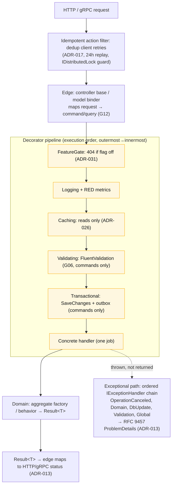
```mermaid
flowchart TD
    HTTP["HTTP / gRPC request"]
    EDGE["Edge: controller base / model binder<br/>maps request → command/query (G12)"]
    IDEMP["Idempotent action filter: dedup client retries<br/>(ADR-017, 24h replay, IDistributedLock guard)"]

    subgraph PIPELINE["Decorator pipeline (execution order, outermost→innermost)"]
        direction TB
        FG["FeatureGate: 404 if flag off (ADR-031)"]
        LOG["Logging + RED metrics"]
        CA["Caching: reads only (ADR-026)"]
        VA["Validating: FluentValidation (G06, commands only)"]
        TX["Transactional: SaveChanges + outbox (commands only)"]
        H["Concrete handler (one job)"]
    end

    DOMAIN["Domain: aggregate factory / behavior → Result&lt;T&gt;"]
    RESP["Result&lt;T&gt; → edge maps to HTTP/gRPC status (ADR-013)"]
    EXC["Exceptional path: ordered IExceptionHandler chain<br/>OperationCanceled, Domain, DbUpdate, Validation, Global<br/>→ RFC 9457 ProblemDetails (ADR-013)"]

    HTTP --> IDEMP --> EDGE --> FG --> LOG --> CA --> VA --> TX --> H --> DOMAIN
    DOMAIN --> RESP
    H -.->|"thrown, not returned"| EXC

    classDef dec fill:#fef7e0,stroke:#f9ab00,color:#111
    class FG,LOG,CA,VA,TX,H dec
```

---

## 6. Event-driven integration, outbox dual-dispatch ([ADR-003](https://ivanball.github.io/docs/adr/003-outbox-dual-dispatch.html) / 010 / 021)

Domain events are captured into an `OutboxMessage` row **in the same transaction** as the data
(no dual-write bug). The two event kinds then part ways: **local domain events** are dispatched
in-process by the interceptor right after the save (deferred until after commit inside a
Transactional command) and their outbox rows marked processed, while **integration events** are
never dispatched locally: their rows stay unprocessed until the background `OutboxProcessor`
publishes them through `IMessageBus`, so the registered transport (in-process for a monolith, a
MassTransit broker for extracted services) decides delivery. The processor is also the safety net
for a local dispatch that failed. A handler that publishes an integration event itself calls
`IEventBus.PublishAsync`, which writes outbox rows rather than sending inline (the removed
`IIntegrationEventPublisher` is not a caller-facing option any more). Every integration event carries
a `SchemaVersion`; consumers dedup by `MessageId` via the opt-in inbox.

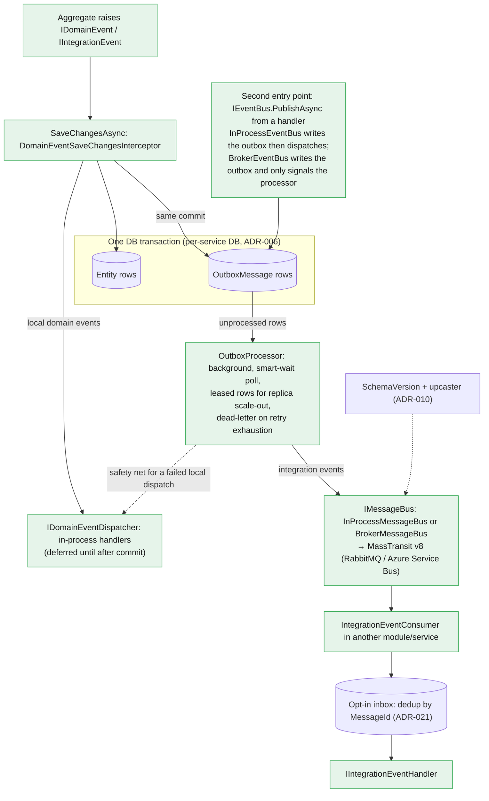
```mermaid
flowchart TD
    AGG["Aggregate raises IDomainEvent / IIntegrationEvent"]
    SAVE["SaveChangesAsync: DomainEventSaveChangesInterceptor"]
    EBUS["Second entry point: IEventBus.PublishAsync from a handler<br/>InProcessEventBus writes the outbox then dispatches;<br/>BrokerEventBus writes the outbox and only signals the processor"]
    subgraph TXN["One DB transaction (per-service DB, ADR-006)"]
        ENTITY[("Entity rows")]
        OBX[("OutboxMessage rows")]
    end
    DISP["IDomainEventDispatcher: in-process handlers<br/>(deferred until after commit)"]
    PROC["OutboxProcessor: background, smart-wait poll,<br/>leased rows for replica scale-out,<br/>dead-letter on retry exhaustion"]
    BUS["IMessageBus: InProcessMessageBus or BrokerMessageBus<br/>→ MassTransit v8 (RabbitMQ / Azure Service Bus)"]
    CONSUMER["IntegrationEventConsumer in another module/service"]
    INBOX[("Opt-in inbox: dedup by MessageId (ADR-021)")]
    HANDLER["IIntegrationEventHandler"]

    AGG --> SAVE
    SAVE --> ENTITY
    SAVE -->|"same commit"| OBX
    SAVE -->|"local domain events"| DISP
    EBUS --> OBX
    OBX -->|"unprocessed rows"| PROC
    PROC -->|"integration events"| BUS
    PROC -.->|"safety net for a failed local dispatch"| DISP
    BUS --> CONSUMER --> INBOX --> HANDLER
    SCHEMA["SchemaVersion + upcaster (ADR-010)"] -.-> BUS

    classDef evt fill:#e6f4ea,stroke:#34a853,color:#111
    class AGG,SAVE,EBUS,PROC,DISP,BUS,CONSUMER,HANDLER evt
```

---

## 7. Modular monolith → extractable services ([ADR-006](https://ivanball.github.io/docs/adr/006-database-per-service.html) / 007 / 008 / 012)

Modules implement `IModule` and are discovered + Kahn-ordered by `ModuleLoader`
([ADR-059](https://ivanball.github.io/docs/adr/059-module-contract-and-composition.html)). The
**same module code** runs as a single monolith host or as N service processes behind a YARP gateway,
because application code talks to abstractions (`IMessageBus`, typed gRPC clients) and transport
lives at the edges. MMCA.ADC has taken the second path all the way: its four modules each run as
their own service host under `Source/Services/` behind the Gateway, and the former single
`MMCA.ADC.WebAPI` host is gone. Deploy A is not hypothetical: it is what MMCA.Helpdesk (its single
Tickets module in one API host) runs.

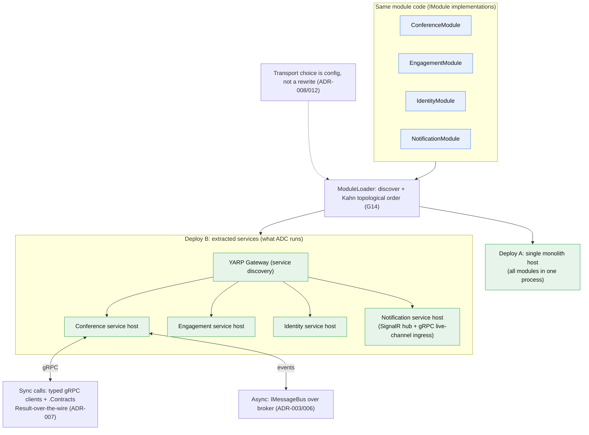
```mermaid
flowchart TD
    subgraph SRC["Same module code (IModule implementations)"]
        MC["ConferenceModule"]
        ME["EngagementModule"]
        MI["IdentityModule"]
        MN["NotificationModule"]
    end
    LOADER["ModuleLoader: discover + Kahn topological order (G14)"]

    MONO["Deploy A: single monolith host<br/>(all modules in one process)"]

    subgraph SERVICES["Deploy B: extracted services (what ADC runs)"]
        direction TB
        GW["YARP Gateway (service discovery)"]
        SVC1["Conference service host"]
        SVC2["Engagement service host"]
        SVC3["Identity service host"]
        SVC4["Notification service host<br/>(SignalR hub + gRPC live-channel ingress)"]
        GW --> SVC1
        GW --> SVC2
        GW --> SVC3
        GW --> SVC4
    end

    SYNC["Sync calls: typed gRPC clients + .Contracts<br/>Result-over-the-wire (ADR-007)"]
    ASYNC["Async: IMessageBus over broker (ADR-003/006)"]

    SRC --> LOADER
    LOADER --> MONO
    LOADER --> SERVICES
    SVC1 <-->|"gRPC"| SYNC
    SVC1 <-->|"events"| ASYNC
    NOTE["Transport choice is config, not a rewrite (ADR-008/012)"]
    NOTE -.-> LOADER

    classDef mod fill:#e8f0fe,stroke:#4285f4,color:#111
    classDef dep fill:#e6f4ea,stroke:#34a853,color:#111
    class MC,ME,MI,MN mod
    class MONO,GW,SVC1,SVC2,SVC3,SVC4 dep
```

---

## 8. Persistence, database-per-service + polyglot engines ([ADR-006](https://ivanball.github.io/docs/adr/006-database-per-service.html) / 018 / 030)

One concrete `SQLServerDbContext` over the abstract `ApplicationDbContext`, **one instance per
database**. Each entity is engine-agnostic; a single `[UseDataSource(engine)]` attribute on its
config class picks SQL Server, Cosmos, or SQLite. Cross-source relationships auto-degrade; the outbox
is the cross-source consistency mechanism. Each service self-applies its EF migrations at boot
([ADR-030](https://ivanball.github.io/docs/adr/030-startup-sole-migrator.html)).

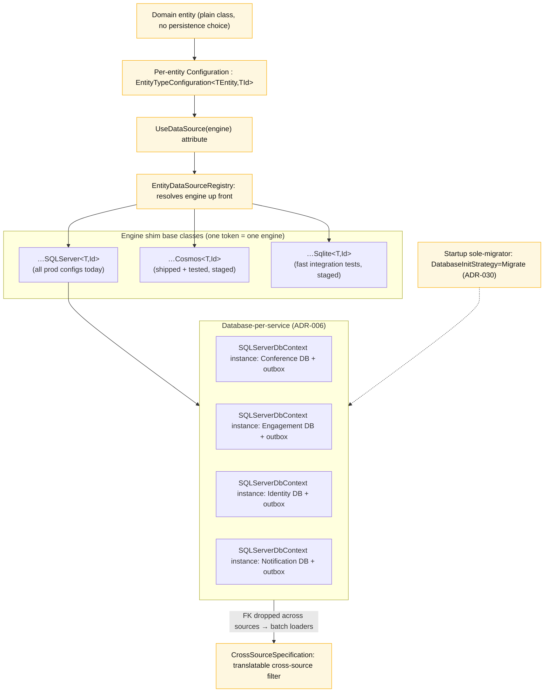
```mermaid
flowchart TD
    ENTITY["Domain entity (plain class, no persistence choice)"]
    CFG["Per-entity Configuration : EntityTypeConfiguration&lt;TEntity,TId&gt;"]
    ATTR["UseDataSource(engine) attribute"]
    REG["EntityDataSourceRegistry: resolves engine up front"]

    subgraph SHIMS["Engine shim base classes (one token = one engine)"]
        SQL["…SQLServer&lt;T,Id&gt;<br/>(all prod configs today)"]
        COS["…Cosmos&lt;T,Id&gt;<br/>(shipped + tested, staged)"]
        LITE["…Sqlite&lt;T,Id&gt;<br/>(fast integration tests, staged)"]
    end

    subgraph DBS["Database-per-service (ADR-006)"]
        CTX1["SQLServerDbContext instance: Conference DB + outbox"]
        CTX2["SQLServerDbContext instance: Engagement DB + outbox"]
        CTX3["SQLServerDbContext instance: Identity DB + outbox"]
        CTX4["SQLServerDbContext instance: Notification DB + outbox"]
    end

    XSPEC["CrossSourceSpecification: translatable cross-source filter"]
    MIG["Startup sole-migrator: DatabaseInitStrategy=Migrate (ADR-030)"]

    ENTITY --> CFG --> ATTR --> REG
    REG --> SQL & COS & LITE
    SQL --> DBS
    DBS -->|"FK dropped across sources → batch loaders"| XSPEC
    MIG -.-> DBS

    classDef p fill:#fef7e0,stroke:#f9ab00,color:#111
    class ENTITY,CFG,ATTR,REG,XSPEC,MIG p
```

---

## 9. Authentication & Authorization stack

The auth concern (G08) spans token validation, session cookies, federated sign-in, password hashing,
brute-force protection, refresh-token rotation and revocation, and a layered authorization model:
RBAC roles → opt-in permissions → resource ownership.

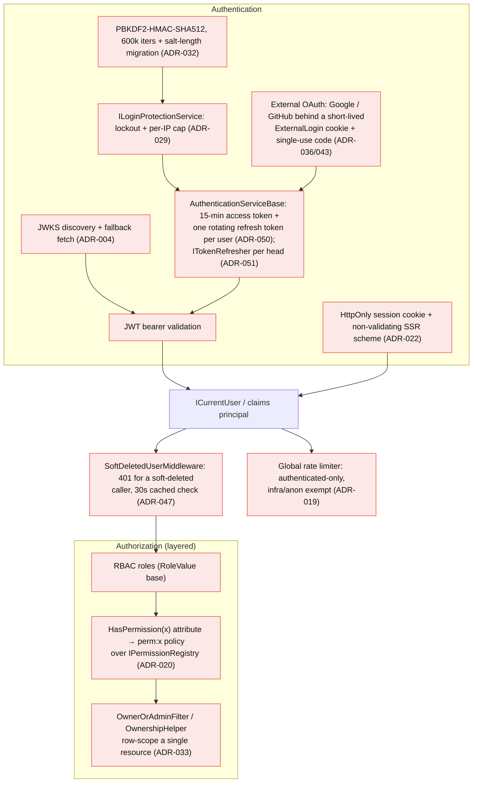
```mermaid
flowchart TD
    subgraph AUTHN["Authentication"]
        JWT["JWT bearer validation"]
        JWKS["JWKS discovery + fallback fetch (ADR-004)"]
        COOKIE["HttpOnly session cookie + non-validating SSR scheme (ADR-022)"]
        HASH["PBKDF2-HMAC-SHA512, 600k iters + salt-length migration (ADR-032)"]
        LOGIN["ILoginProtectionService: lockout + per-IP cap (ADR-029)"]
        EXT["External OAuth: Google / GitHub behind a short-lived<br/>ExternalLogin cookie + single-use code (ADR-036/043)"]
        ROT["AuthenticationServiceBase: 15-min access token +<br/>one rotating refresh token per user (ADR-050);<br/>ITokenRefresher per head (ADR-051)"]
    end

    CU["ICurrentUser / claims principal"]
    REV["SoftDeletedUserMiddleware: 401 for a soft-deleted<br/>caller, 30s cached check (ADR-047)"]

    subgraph AUTHZ["Authorization (layered)"]
        RBAC["RBAC roles (RoleValue base)"]
        PERM["HasPermission(x) attribute → perm:x policy<br/>over IPermissionRegistry (ADR-020)"]
        OWN["OwnerOrAdminFilter / OwnershipHelper<br/>row-scope a single resource (ADR-033)"]
    end

    RL["Global rate limiter: authenticated-only,<br/>infra/anon exempt (ADR-019)"]

    JWT --> CU
    JWKS --> JWT
    COOKIE --> CU
    HASH --> LOGIN
    LOGIN --> ROT
    EXT --> ROT
    ROT --> JWT
    CU --> REV
    REV --> RBAC --> PERM --> OWN
    CU --> RL

    classDef a fill:#fce8e6,stroke:#ea4335,color:#111
    class JWT,JWKS,COOKIE,HASH,LOGIN,EXT,ROT,REV,RBAC,PERM,OWN,RL a
```

---

## 10. Notifications, three channels behind one send pipeline ([ADR-024](https://ivanball.github.io/docs/adr/024-push-notifications.html) / [044](https://ivanball.github.io/docs/adr/044-native-push-delivery.html))

One use case (`SendPushNotificationHandler`) writes a durable per-user inbox, fires a transient
SignalR push, and then an OS-level native push that reaches a backgrounded or killed app. The inbox
is the source of truth, so both push legs are non-fatal: a failed SignalR send marks the audit row
failed, a failed native send is only logged. Recipient providers resolve who gets notified; the thin
`MMCA.ADC.Notification` module hosts the hub. Email is a **separate** framework leg
(`IEmailSender` / `SmtpEmailSender`) driven by its own handlers, not something the push sender fans
out to, and the same hub also carries [ADR-039](https://ivanball.github.io/docs/adr/039-live-channel-push.html)'s
deliberately non-durable live-channel events.

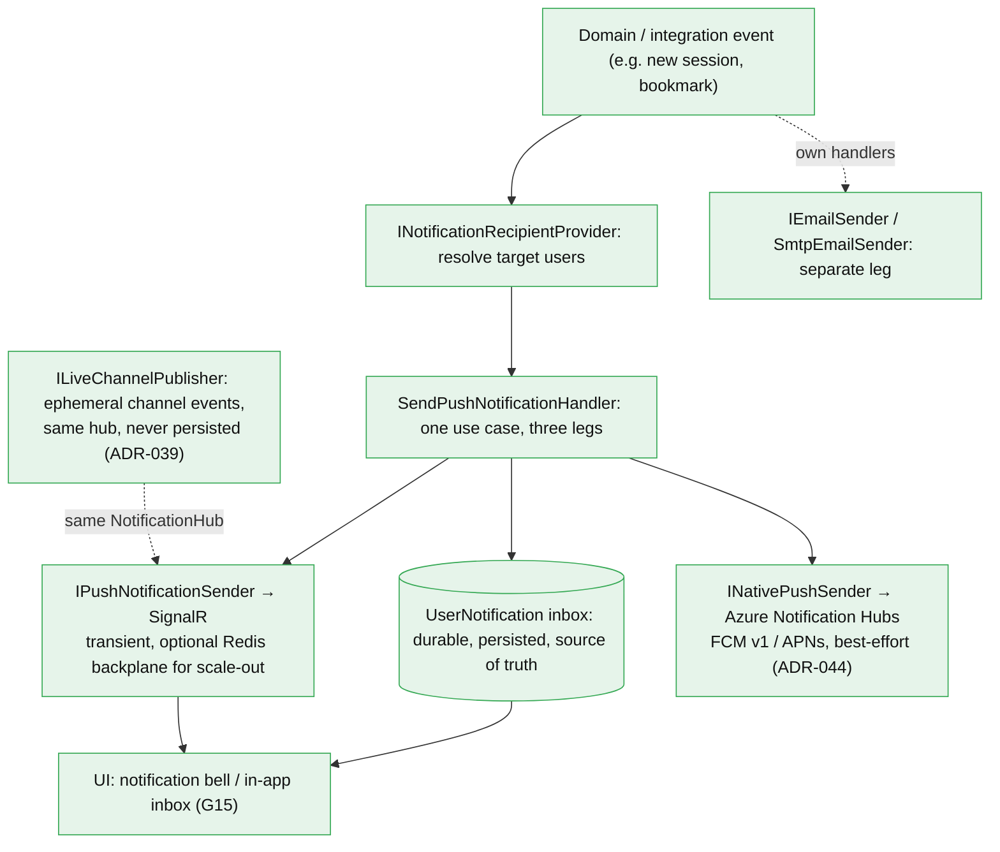
```mermaid
flowchart TD
    SRC["Domain / integration event (e.g. new session, bookmark)"]
    RP["INotificationRecipientProvider: resolve target users"]
    UC["SendPushNotificationHandler: one use case, three legs"]
    DURABLE[("UserNotification inbox: durable, persisted, source of truth")]
    PUSH["IPushNotificationSender → SignalR<br/>transient, optional Redis backplane for scale-out"]
    NATIVE["INativePushSender → Azure Notification Hubs<br/>FCM v1 / APNs, best-effort (ADR-044)"]
    LIVE["ILiveChannelPublisher: ephemeral channel events,<br/>same hub, never persisted (ADR-039)"]
    EMAIL["IEmailSender / SmtpEmailSender: separate leg"]
    UIBELL["UI: notification bell / in-app inbox (G15)"]

    SRC --> RP --> UC
    UC --> DURABLE
    UC --> PUSH
    UC --> NATIVE
    SRC -.->|"own handlers"| EMAIL
    LIVE -.->|"same NotificationHub"| PUSH
    DURABLE --> UIBELL
    PUSH --> UIBELL

    classDef n fill:#e6f4ea,stroke:#34a853,color:#111
    class SRC,RP,UC,DURABLE,PUSH,NATIVE,LIVE,EMAIL,UIBELL n
```

---

## 11. UI, write-once render everywhere + i18n + theming

A page is authored **once** as a Razor component in a per-module UI library; both the Blazor web host
(Server + WASM) and the .NET MAUI host reference the same libraries, so it renders across Web,
Android, iOS, macOS, Windows. `InteractiveAuto` is declared once on each web head's root router with
prerendering left on ([ADR-056](https://ivanball.github.io/docs/adr/056-blazor-render-mode-strategy.html)),
so no page carries its own `@rendermode`. Anything a browser cannot do is a per-capability contract
in `MMCA.Common.UI` with MAUI-native, browser-JS and inert fallback adapters chosen at DI composition
time ([ADR-042](https://ivanball.github.io/docs/adr/042-device-capability-abstraction.html), taught in
G26). Culture cookie + `IStringLocalizer` drive i18n ([ADR-027](https://ivanball.github.io/docs/adr/027-multi-locale-i18n.html)); `ThemeService`
drives day/dark ([ADR-028](https://ivanball.github.io/docs/adr/028-dark-theme-mode.html)).

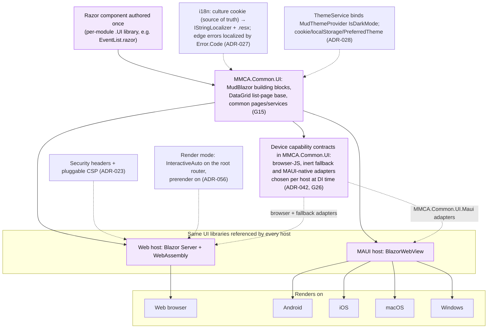
```mermaid
flowchart TD
    PAGE["Razor component authored once<br/>(per-module .UI library, e.g. EventList.razor)"]
    COMMONUI["MMCA.Common.UI: MudBlazor building blocks,<br/>DataGrid list-page base, common pages/services (G15)"]

    subgraph HOSTS["Same UI libraries referenced by every host"]
        WEB["Web host: Blazor Server + WebAssembly"]
        MAUI["MAUI host: BlazorWebView"]
    end

    subgraph TARGETS["Renders on"]
        BROWSER["Web browser"]
        AND["Android"]
        IOS["iOS"]
        MAC["macOS"]
        WIN["Windows"]
    end

    I18N["i18n: culture cookie (source of truth) →<br/>IStringLocalizer + .resx; edge errors localized by Error.Code (ADR-027)"]
    THEME["ThemeService binds MudThemeProvider IsDarkMode;<br/>cookie/localStorage/PreferredTheme (ADR-028)"]
    CSP["Security headers + pluggable CSP (ADR-023)"]
    RM["Render mode: InteractiveAuto on the root router,<br/>prerender on (ADR-056)"]
    CAP["Device capability contracts in MMCA.Common.UI:<br/>browser-JS, inert fallback and MAUI-native adapters<br/>chosen per host at DI time (ADR-042, G26)"]

    PAGE --> COMMONUI
    COMMONUI --> WEB
    COMMONUI --> MAUI
    WEB --> BROWSER
    MAUI --> AND & IOS & MAC & WIN
    I18N -.-> COMMONUI
    THEME -.-> COMMONUI
    CSP -.-> WEB
    RM -.-> WEB
    COMMONUI --> CAP
    CAP -.->|"browser + fallback adapters"| WEB
    CAP -.->|"MMCA.Common.UI.Maui adapters"| MAUI

    classDef u fill:#f3e8fd,stroke:#a142f4,color:#111
    class PAGE,COMMONUI,WEB,MAUI,CAP u
```

---

## 12. ADC business modules, bounded contexts end-to-end

Each ADC module is a vertical slice through all layers. Conference is large enough to split across
five chapters (G17-G21); Engagement takes two (G22 session bookmarks, G23 the conference-day live
layer); Identity is one (G24); Notification is the thin host over the Common notifications
capability, taught in G10.

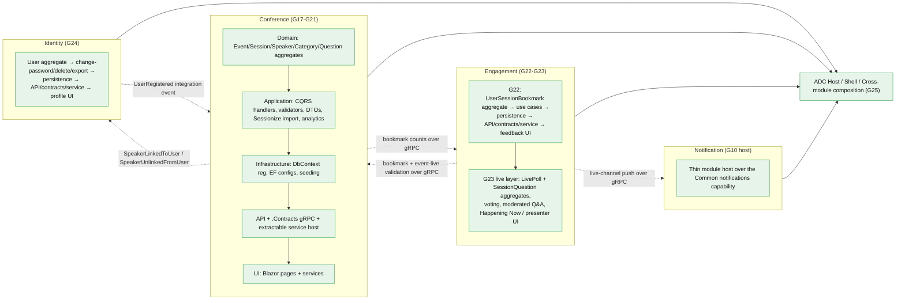
```mermaid
flowchart LR
    subgraph CONF["Conference (G17-G21)"]
        direction TB
        C_D["Domain: Event/Session/Speaker/Category/Question aggregates"]
        C_A["Application: CQRS handlers, validators, DTOs, Sessionize import, analytics"]
        C_I["Infrastructure: DbContext reg, EF configs, seeding"]
        C_P["API + .Contracts gRPC + extractable service host"]
        C_U["UI: Blazor pages + services"]
        C_D --> C_A --> C_I --> C_P --> C_U
    end

    subgraph ENG["Engagement (G22-G23)"]
        direction TB
        E["G22: UserSessionBookmark aggregate → use cases →<br/>persistence → API/contracts/service → feedback UI"]
        EL["G23 live layer: LivePoll + SessionQuestion aggregates,<br/>voting, moderated Q&amp;A, Happening Now / presenter UI"]
        E --> EL
    end

    subgraph IDN["Identity (G24)"]
        direction TB
        I["User aggregate → change-password/delete/export →<br/>persistence → API/contracts/service → profile UI"]
    end

    subgraph NOT["Notification (G10 host)"]
        direction TB
        N["Thin module host over the Common notifications capability"]
    end

    HOST["ADC Host / Shell / Cross-module composition (G25)"]

    CONF --> HOST
    ENG --> HOST
    IDN --> HOST
    NOT --> HOST

    IDN -.->|"UserRegistered integration event"| CONF
    CONF -.->|"SpeakerLinkedToUser / SpeakerUnlinkedFromUser"| IDN
    ENG -.->|"bookmark + event-live validation over gRPC"| CONF
    CONF -.->|"bookmark counts over gRPC"| ENG
    ENG -.->|"live-channel push over gRPC"| NOT

    classDef adc fill:#e6f4ea,stroke:#34a853,color:#111
    class C_D,C_A,C_I,C_P,C_U,E,EL,I,N,HOST adc
```

---

## 13. The ADRs, grouped by theme

Every accepted ADR in `Website/docs-src/adr/`, clustered by the concern it governs. That directory's
[`README.md`](https://ivanball.github.io/docs/adr/) is the canonical index and owns the count and
range; this map only regroups it. (011 is struck through there: superseded by 027.)

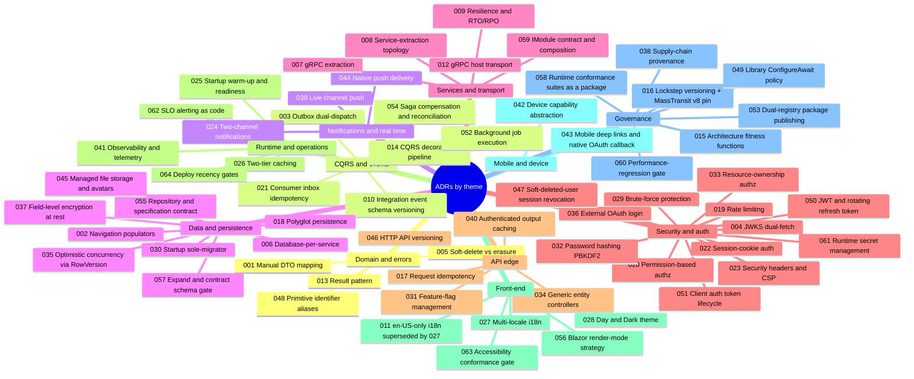
```mermaid
mindmap
  root(("ADRs by theme"))
    Domain and errors
      013 Result pattern
      005 Soft-delete vs erasure
      001 Manual DTO mapping
      048 Primitive identifier aliases
    CQRS and events
      014 CQRS decorator pipeline
      003 Outbox dual-dispatch
      010 Integration event schema versioning
      021 Consumer inbox idempotency
      054 Saga compensation and reconciliation
      052 Background job execution
    Notifications and real time
      024 Two-channel notifications
      039 Live channel push
      044 Native push delivery
    Data and persistence
      006 Database-per-service
      018 Polyglot persistence
      030 Startup sole-migrator
      002 Navigation populators
      035 Optimistic concurrency via RowVersion
      055 Repository and specification contract
      037 Field-level encryption at rest
      045 Managed file storage and avatars
      057 Expand and contract schema gate
    Services and transport
      007 gRPC extraction
      008 Service-extraction topology
      012 gRPC host transport
      009 Resilience and RTO/RPO
      059 IModule contract and composition
    Security and auth
      004 JWKS dual-fetch
      020 Permission-based authz
      022 Session-cookie auth
      029 Brute-force protection
      032 Password hashing PBKDF2
      033 Resource-ownership authz
      019 Rate limiting
      023 Security headers and CSP
      036 External OAuth login
      047 Soft-deleted-user session revocation
      050 JWT and rotating refresh token
      051 Client auth token lifecycle
      061 Runtime secret management
    API edge
      017 Request idempotency
      031 Feature-flag management
      034 Generic entity controllers
      040 Authenticated output caching
      046 HTTP API versioning
    Runtime and operations
      025 Startup warm-up and readiness
      026 Two-tier caching
      041 Observability and telemetry
      062 SLO alerting as code
      064 Deploy recency gates
    Front-end
      027 Multi-locale i18n
      028 Day and Dark theme
      056 Blazor render-mode strategy
      063 Accessibility conformance gate
      011 en-US-only i18n superseded by 027
    Mobile and device
      042 Device capability abstraction
      043 Mobile deep links and native OAuth callback
    Governance
      015 Architecture fitness functions
      016 Lockstep versioning + MassTransit v8 pin
      038 Supply-chain provenance
      049 Library ConfigureAwait policy
      053 Dual-registry package publishing
      058 Runtime conformance suites as a package
      060 Performance-regression gate
```

---

## 14. The 34-category evaluation rubric

The lens the guide tags code against (`[Rubric §N]`). Scored on two axes: **Maturity** (0-4, process)
and **Implementation** (0-10, substance). Three parts.

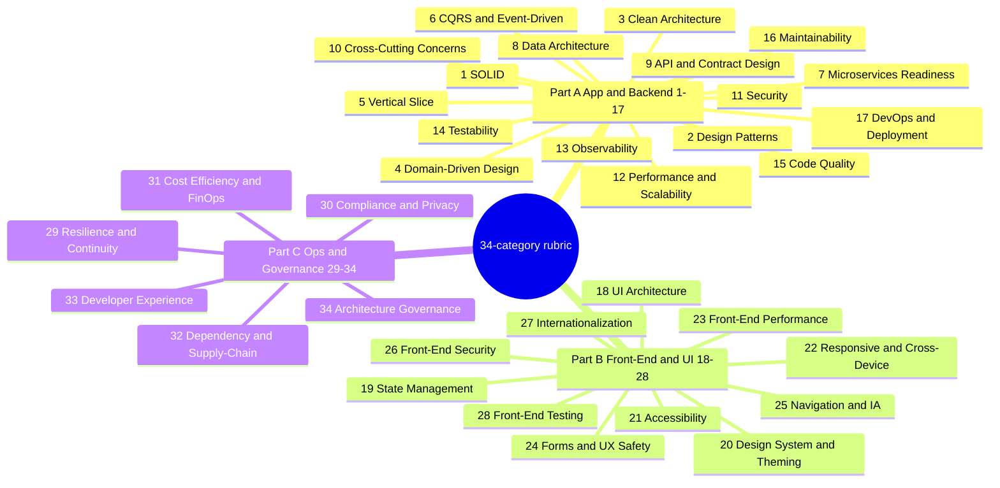
```mermaid
mindmap
  root(("34-category rubric"))
    Part A App and Backend 1-17
      1 SOLID
      2 Design Patterns
      3 Clean Architecture
      4 Domain-Driven Design
      5 Vertical Slice
      6 CQRS and Event-Driven
      7 Microservices Readiness
      8 Data Architecture
      9 API and Contract Design
      10 Cross-Cutting Concerns
      11 Security
      12 Performance and Scalability
      13 Observability
      14 Testability
      15 Code Quality
      16 Maintainability
      17 DevOps and Deployment
    Part B Front-End and UI 18-28
      18 UI Architecture
      19 State Management
      20 Design System and Theming
      21 Accessibility
      22 Responsive and Cross-Device
      23 Front-End Performance
      24 Forms and UX Safety
      25 Navigation and IA
      26 Front-End Security
      27 Internationalization
      28 Front-End Testing
    Part C Ops and Governance 29-34
      29 Resilience and Continuity
      30 Compliance and Privacy
      31 Cost Efficiency and FinOps
      32 Dependency and Supply-Chain
      33 Developer Experience
      34 Architecture Governance
```

---

## 15. How the axes fit together (reading map)

The guide is organized on **two axes at once**. This ties the diagrams above back to the guide's
navigation.

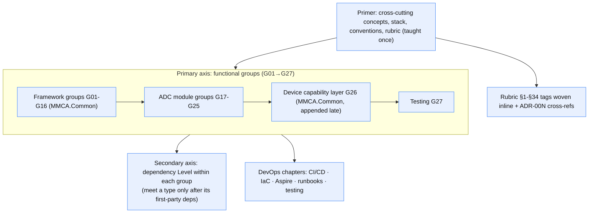
```mermaid
flowchart TD
    PRIMER["Primer: cross-cutting concepts, stack, conventions, rubric (taught once)"]

    subgraph AXIS1["Primary axis: functional groups (G01→G27)"]
        FW["Framework groups G01-G16 (MMCA.Common)"]
        ADCG["ADC module groups G17-G25"]
        CAPG["Device capability layer G26 (MMCA.Common, appended late)"]
        TESTG["Testing G27"]
        FW --> ADCG --> CAPG --> TESTG
    end

    AXIS2["Secondary axis: dependency Level within each group<br/>(meet a type only after its first-party deps)"]

    LENS["Rubric §1-§34 tags woven inline + ADR-00N cross-refs"]
    DEVOPS["DevOps chapters: CI/CD · IaC · Aspire · runbooks · testing"]

    PRIMER --> AXIS1
    PRIMER --> LENS
    AXIS1 --> AXIS2
    AXIS1 --> DEVOPS

    classDef m fill:#e8f0fe,stroke:#4285f4,color:#111
    class PRIMER,FW,ADCG,CAPG,TESTG,AXIS2,LENS,DEVOPS m
```

---

### Notes on fidelity

- Group-to-group arrows in §3 show the **dominant** "builds on" direction from the charters and Level
  ranges in [`00-group-taxonomy.md`](00-group-taxonomy.md); the guide allows forward references where
  functional cohesion outranks strict layering, so a few minor edges are omitted for readability.
- **GNN here is the chapter number** (`group-NN-*.md`), the numbering the index and the reading paths
  use. [`00-group-taxonomy.md`](00-group-taxonomy.md) still carries the original classification ids
  for the chapters inserted later (its G26 is the live layer, chapter 23; its G27 is the device
  capability layer, chapter 26; its G25 is testing, chapter 27), so match that table by chapter
  filename rather than by its id.
- Pattern diagrams (§4-§12) reflect the mechanisms as taught in the corresponding `group-NN-*.md`
  chapters and the ADRs named in [`00-primer.md`](00-primer.md).
- The 20 dependency cycles (SCCs) listed in the manifest are kept whole inside a single group
  (e.g. the `ApplicationDbContext` ↔ interceptors cycle in G07, the Conference aggregate nav-cycles in
  G17); they are not drawn as separate nodes here.
